<div align="center">

<div style="margin: 20px 0;">
  <a href="docs/assets/moegambit-chess.png">
    
  </a>
</div>

# MoEGambit

### 面向分布式混合专家训练的选择性状态修复

为 Megatron-LM 与 DeepSpeed 提供框架无关的热替换、版本感知状态恢复和事务式故障恢复。

[](https://github.com/ZJUAntgroup/MoEGambit/stargazers)
[](LICENSE)
[](pyproject.toml)
[](Megatron-LM)
[](DeepSpeed)

[](README.md)
[](README-zh.md)

[项目概览](#项目概览) · [快速开始](#快速开始) ·
[系统架构](#系统架构) · [运行示例](#多机运行示例) ·
[恢复契约](#恢复契约) · [论文结果](#论文结果)

<a href="docs/assets/moegambit-runtime-architecture.png">
  
</a>

<sub>点击图片可查看原始分辨率大图。</sub>

</div>

## 项目概览

MoEGambit 是论文 **《MoEGambit: Selective State Repair for Distributed
Mixture-of-Experts Training》** 的配套实现。发生 fail-stop rank 故障后，
MoEGambit 能够保持分布式训练作业存活，激活常驻替补 worker，按确定性顺序
重建通信组，并从当前最安全的状态源恢复训练状态。

系统的核心是混合恢复：

- 从健康 peer 拉取处于当前已提交版本的非专家复制状态；
- 当不存在在线专家副本时，从 checkpoint 一起恢复专家权重与对应优化器状态；
- 在 adapter 与版本校验支持时，使用在线专家副本和已确认的主机内存优化器副本；
- 无法证明安全性的恢复路径会 fail closed，回退到 checkpoint relaunch。

MoEGambit 将恢复策略和编排逻辑与训练框架解耦。Megatron-LM 与 DeepSpeed
内部只保留生命周期 hook；对应 adapter 将框架对象转换到同一套恢复契约。

## 核心特性

- **一套恢复 runtime：** `src/moegambit/` 中统一实现 controller、watcher
  协议、策略、进程组编排、可观测性和 CLI。
- **两套框架 adapter：** Megatron-LM 与 DeepSpeed 使用相同的 adapter
  边界以及 launcher/watcher 入口。
- **常驻热备：** survivor 保留原有 Python 与 CUDA 进程，由 spare 接管
  故障进程的 logical rank。
- **版本感知恢复：** 仅在 model、optimizer、scheduler、RNG、data cursor
  和 checkpoint 记录版本兼容时执行恢复。
- **阶段感知事务：** forward、backward、optimizer 和 checkpoint 发布阶段
  的故障均有明确的 replay 或 fallback 语义。
- **质量风险准入（可选）：** 公共协调器新增论文的 `R <= 1` 风险规则，支持审计与
  执行模式；执行需要有效的整场训练风险证据。引擎兼容路径仍使用原有策略，详见
  [审计工具说明](docs/ARTIFACT_AUDIT.md)。
- **Fail-closed：** 参数可能已发生变化时，MoEGambit 不会只回退 iteration
  计数器而继续执行。

## 快速开始

### 安装

要求 Python 3.10 或更高版本。安装 MoEGambit 之前，请先安装与集群匹配的
CUDA 版 PyTorch。

```bash
git clone https://github.com/ZJUAntgroup/MoEGambit.git
cd MoEGambit

python3 -m venv .venv
source .venv/bin/activate
python -m pip install --upgrade pip setuptools wheel

# 首先安装与集群 CUDA 版本匹配的 PyTorch wheel。
python -m pip install torch --index-url <PYTORCH_CUDA_WHEEL_INDEX>

# 安装 MoEGambit 及开发检查依赖。
python -m pip install -e '.[dev]'
```

根据训练任务安装所需框架。下面列出的是仓库内 Megatron 与 DeepSpeed
Qwen3-MoE 示例的必要依赖：

```bash
# Megatron-LM
python -m pip install \
  'numpy<2.0.0' 'packaging>=24.2' \
  pybind11 Cython sentencepiece tiktoken
python -m pip install 'transformer-engine[pytorch]'
python -m pip install -e ./Megatron-LM

# DeepSpeed
python -m pip install -r deepspeed_requirements.txt
python -m pip install --upgrade 'transformers>=5.0.0,<6'
python -m pip install -e ./DeepSpeed
```

`deepspeed_requirements.txt` 会安装 `accelerate`、`einops`、`hjson`、
`msgpack`、`ninja`、`numpy`、`packaging`、`psutil`、`py-cpuinfo`、
`pydantic`、`tqdm` 和 `transformers`。上面的显式升级不能省略：
`deepspeed_qwen3_moe_pretrain.py` 与 DeepSpeed 启动前检查均要求
`transformers>=5.0.0`。如果环境中仍是 `transformers==4.45.0`，
分布式作业会在启动前被拒绝。

仓库中的脚本会显式优先加载项目内置的框架源码：

```bash
export PYTHONPATH="$PWD/src:$PWD/DeepSpeed:$PWD/Megatron-LM${PYTHONPATH:+:$PYTHONPATH}"
```

### 验证安装

```bash
python - <<'PY'
import torch
import moegambit
import moegambit.adapters.deepspeed
from moegambit.runtime.discovery import discover_adapters

assert torch.cuda.is_available()
assert torch.distributed.is_available()
print("torch:", torch.__version__, "cuda:", torch.version.cuda)
print("moegambit:", moegambit.__file__)
print("adapters:", sorted(discover_adapters()))
PY

moegambit-doctor
python -m pytest tests -q
```

安装后提供以下命令：

| 命令 | 用途 |
| --- | --- |
| `moegambit-launch` | 构建或启动由 adapter 选择的训练命令 |
| `moegambit-watch` | 通用 watcher client 入口 |
| `moegambit-watcher` | 带认证的框架无关 coordinator |
| `moegambit-doctor` | 检查本地 runtime 环境 |
| `moegambit-elastic-launcher` | Megatron/DeepSpeed 兼容 launcher |
| `moegambit-elastic-watcher` | Megatron/DeepSpeed 兼容 watcher |

## 系统架构

```text
framework hook
      │
      ▼
EngineAdapter（Megatron / DeepSpeed / Generic DDP）
      │
      ├── 框架生命周期与状态转换
      ▼
moegambit runtime + policy + control plane
      │
      ├── 故障分类与恢复计划
      ├── spare 分配与拓扑 manifest
      ├── 确定性进程组重建
      ├── peer / replica / checkpoint 状态源选择
      └── commit、rollback、fallback 与可观测性
```

依赖方向必须保持为：

```text
framework hook -> framework adapter -> moegambit interfaces/runtime/core
```

框架无关代码不能重新放回 `Megatron-LM/`、`DeepSpeed/` 或框架 adapter 中。
Megatron 只有一个公开集成入口：

```python
from moegambit.adapters.megatron.hooks import megatron_hooks
```

Megatron 通过该 singleton 发布框架事件和对象。恢复配置、故障分类、
rollback/replay 策略、进程组重建状态和诊断逻辑均位于
`src/moegambit/adapters/megatron/`。

完整设计请参阅
[统一恢复架构](docs/design/UNIFIED_RECOVERY_ARCHITECTURE.md)。

### 仓库结构

```text
.
├── src/moegambit/
│   ├── core/                  # 不依赖框架的契约与决策
│   ├── runtime/               # 编排、热备、watcher client 与协议
│   ├── interfaces/            # EngineAdapter 协议
│   ├── adapters/
│   │   ├── megatron/          # Megatron 状态与拓扑集成
│   │   ├── deepspeed/         # DeepSpeed engine 与 ZeRO 集成
│   │   └── generic_ddp/       # 框架无关的参考 adapter
│   ├── control/               # 带认证的控制面与冻结恢复计划
│   ├── distributed/           # 拓扑与 c10d 兼容层
│   └── replication/           # 优化器主机内存复制
├── Megatron-LM/               # Megatron Core 0.15.3 + 最小 hook
├── DeepSpeed/                 # DeepSpeed 0.19.3 + 最小 hook
├── examples/
│   ├── megatron/run_hot_spare.sh
│   ├── deepspeed/run_hot_spare.sh
│   └── generic_ddp/
├── elastic_launcher.py        # adapter-aware 兼容 launcher
├── elastic_watcher.py         # adapter-aware 兼容 watcher
├── test_hotspare_replace.sh
└── test_deepspeed_hotspare_replace.sh
```

### Adapter 支持情况

| 能力 | Megatron-LM | DeepSpeed | Generic DDP |
| --- | :---: | :---: | :---: |
| 通用 launcher/watcher 分发 | ✓ | ✓ | 参考实现 |
| 常驻 rank 热替换 | ✓ | ✓ | 示例实现 |
| 确定性通信组重建 | TP/PP/EP/DP | engine groups | DDP |
| Peer 模型状态恢复 | ✓ | ✓ | adapter 契约 |
| 主机端优化器复制 | distributed optimizer | ZeRO-2 | adapter 契约 |
| Checkpoint fallback | ✓ | ✓ | ✓ |
| 阶段感知事务契约 | ✓ | ✓ | ✓ |

## 恢复契约

对于 fail-stop 事件 `<r, t, c>`——故障 logical rank `r`、当前 iteration
`t` 和最后 checkpoint `c`——恢复协议按以下步骤执行：

1. 冻结恢复计划并增加 recovery epoch。
2. 将故障 rank 标记为 `RECOVERING`，阻止 optimizer commit，并丢弃
   in-flight iteration。
3. 分配物理 spare，同时保持故障进程原有的 logical rank。
4. 使用唯一的标准拓扑 manifest 重建全部进程组。
5. 按组件和已提交版本选择兼容的状态源。
6. 先恢复权重，再在 update barrier 保护下挂载 optimizer state。
7. 仅当需要 replay 时回退 data cursor。
8. 执行一个完整的恢复后 iteration。
9. 提交 epoch，并执行状态转换
   `RECOVERING → REPAIRED → BARRIER → HEALTHY`。

公共协调器新增可选质量风险策略：只有经过校准的整场训练质量越界风险上界满足
`R <= 1` 时，才允许候选混合恢复。默认目标固定为 `eta_final=0.005`、
`eta_peak=0.01`、`alpha_run=0.05`，不以 checkpoint 年龄或专家密度作为准入阈值。
证据绑定模型、遥测版本、策略版本、当前故障、状态来源和完整恢复历史。证据缺失、
过期或超出验证范围时回退 checkpoint；完整 checkpoint 也不可用时中止。

`--policy quality-risk` 默认仅审计，不执行候选混合恢复。执行模式需要协调器管理的
可信风险提供器及外部审核的校准证据。仓库没有附带已训练的风险预测器；填写 JSON
不能构成统计保证。原 `MoeHybridPolicy` 和引擎兼容路径尚未迁移，不能据此宣称它们
已经实现论文的新公式。新增状态比对、逐 rank 完成核验和小型证据导出使用
`moegambit-audit`，详见 [使用说明与适用边界](docs/ARTIFACT_AUDIT.md)。

### 不同故障阶段的语义

最后一次已提交的 optimizer version 与当前正在执行的 iteration 是两个不同概念：

| 故障阶段 | 必须执行的恢复 |
| --- | --- |
| forward、backward、optimizer-before | 丢弃梯度，回退数据，并从最后已提交 step replay |
| optimizer-during | 从上一个已提交 replica 恢复 model 和 optimizer 后 replay |
| optimizer-after，但 replica 未提交 | checkpoint relaunch；禁止只回退 bookkeeping |
| step 已提交 | 从已提交 optimizer version 恢复 |
| checkpoint commit record 发布前或发布中 | 忽略未完成 checkpoint |
| checkpoint commit record 发布后 | 新 checkpoint 可用于 restart |

只有主机内存 peer replica 确认同一版本后，optimizer step 才会被发布为 safe
point。如果 adapter 无法证明 optimizer-during 故障所需恢复是安全的，则恢复
会中止或回退到 checkpoint relaunch。

## 多机运行示例

仓库提供的验证拓扑使用九台同构节点：

- 节点 `0-7`：每台八张 active GPU；
- 节点 `8`：八个常驻 replacement worker；
- 64 个 logical rank；
- step `10` 保存 checkpoint，step `17` 注入故障。

每台节点运行相同脚本，仅修改 `NODE_RANK`。`MASTER_ADDR` 和
`ELASTIC_WATCHER_ADDR` 必须能被所有节点访问。

### Megatron-LM

```bash
# Active 节点：依次使用 NODE_RANK=0、1 ... 7 运行。
NODE_RANK=0 \
MASTER_ADDR=<node-0-routable-ip> \
ELASTIC_WATCHER_ADDR=<node-8-routable-ip> \
bash examples/megatron/run_hot_spare.sh

# Spare 节点。
NODE_RANK=8 \
MASTER_ADDR=<node-0-routable-ip> \
ELASTIC_WATCHER_ADDR=<node-8-routable-ip> \
bash examples/megatron/run_hot_spare.sh
```

已验证的 Megatron 拓扑为 PP=8、EP=8、TP=1。常用覆盖项：

```bash
export FAULT_INJECT_STEP=17
export FAULT_INJECT_NODE=0
export FAULT_INJECT_LOCAL_RANK=1
export TRAIN_ITERS=100
export SAVE_INTERVAL=10
export DATA_PATH=/shared/moegambit/data/train_text_document
export CKPT_DIR=/shared/moegambit/checkpoints/megatron
```

### DeepSpeed

```bash
# Active 节点：依次使用 NODE_RANK=0、1 ... 7 运行。
NODE_RANK=0 \
MASTER_ADDR=<node-0-routable-ip> \
ELASTIC_WATCHER_ADDR=<node-8-routable-ip> \
TEST_MODE=hot_swap \
bash examples/deepspeed/run_hot_spare.sh

# Spare 节点。
NODE_RANK=8 \
MASTER_ADDR=<node-0-routable-ip> \
ELASTIC_WATCHER_ADDR=<node-8-routable-ip> \
TEST_MODE=hot_swap \
bash examples/deepspeed/run_hot_spare.sh
```

DeepSpeed 验证模式：

| `TEST_MODE` | 拓扑 | 行为 |
| --- | --- | --- |
| `hot_swap` | PP=8、EP=8、ZeRO-1 | 在节点 8 替换一个故障 rank |
| `zero2` | PP=1、EP=8、ZeRO-2 | 通过 D2H/TCP 复制 optimizer shard |
| `combined` | PP=1、EP=8、ZeRO-2 | rank 替换与 optimizer 复制同时启用 |
| `all` | 顺序执行 | 先运行 `hot_swap`，再运行 `zero2` |

DeepSpeed `PipelineEngine` 不支持 ZeRO-2/3，因此本仓库不声明支持
PP=8 与 ZeRO-2 的组合。

### Dense 模型

Megatron-LM 和 DeepSpeed 均可使用 dense 模型。必须在所有训练节点和 watcher/备用节点设置
`MOEGAMBIT_MODEL_KIND=dense`，且使用不含专家层的模型。训练端会校验这个声明；
误将带专家的模型声明为 dense 会直接报错。下面两个独立 dense 示例使用合成数据；
上面的 Qwen3-MoE 验证脚本仍是 MoE 专用的。

两个示例默认使用两个单 GPU 训练节点和一个单 GPU 备用节点。先按上文安装依赖，
在所有节点设置相同的共享 `RUN_ROOT` 及可互通的地址。先启动备用节点
（`NODE_RANK=2`），再启动训练节点 0、1。下面的地址仅用于文档示例，运行前须
替换为实际可达地址；不需要私有数据集、tokenizer 或模型权重。

```bash
export RUN_ROOT=/shared/runs/dense-example
export MASTER_ADDR=192.0.2.10
export ELASTIC_WATCHER_ADDR=192.0.2.12

# 备用节点：
NODE_RANK=2 bash examples/megatron/run_dense.sh
# 两个训练节点分别执行：
NODE_RANK=0 bash examples/megatron/run_dense.sh
NODE_RANK=1 bash examples/megatron/run_dense.sh
```

DeepSpeed 示例使用另一个 `RUN_ROOT`，每次运行设置不同的 `RUN_ID`：

```bash
export RUN_ROOT=/shared/runs/dense-deepspeed-example
export RUN_ID=dense-demo-001
export MASTER_ADDR=192.0.2.10
export ELASTIC_WATCHER_ADDR=192.0.2.12

# 备用节点：
NODE_RANK=2 bash examples/deepspeed/run_dense.sh
# 两个训练节点分别执行：
NODE_RANK=0 bash examples/deepspeed/run_dense.sh
NODE_RANK=1 bash examples/deepspeed/run_dense.sh
```

脚本写入
`completed.json`，检查恢复后的最终 step、`mode=rank_in_process_peer` 与零专家
陈旧度。两个脚本均可设置 `DRY_RUN=1`，只打印命令而不占用 GPU。默认在第 4 步
checkpoint 之后、第 5 步已提交边界注入故障。这些小型合成任务仅检验恢复路径，
不用于测量恢复耗时或训练质量。

Megatron-LM 使用常规 `pretrain_gpt.py` dense 配置：不传 `--num-experts`，
设置 `EP_SIZE=1`，仍传 `--moe-moegambit-enable` 开启恢复 hook，并确保同一
TP/PP/CP 分片有至少两个 DP 副本。替换 rank 从 checkpoint 构造基础状态，再从当前
step 的 DP 同伴接收全部 dense 参数、持久化 buffer 和优化器状态。没有有效同伴时
拒绝热修复；只有存在有效 checkpoint 时才能执行 checkpoint relaunch。dense 路径
不使用专家 sidecar。

DeepSpeed 使用相同的 `MOEGAMBIT_HOT_SWAP=1`、`MOEGAMBIT_ZERO2=1`
（ZeRO-2 时）和 checkpoint 设置。模型参数、buffer 和 RNG 从同一步 DP 同伴恢复，
ZeRO-1/2 优化器 shard 从主机内存副本恢复。无需启用 packed-expert checkpoint。
环境变量 `MOEGAMBIT_DEEPSPEED_RECOVERY_STRATEGY` 仍使用
`rank_in_process_hybrid` 作为传输协议名；恢复结果的 `mode` 为
`rank_in_process_peer`，`expert_staleness=0`。PP 与 ZeRO-2 的组合仍不受支持。

自动化测试覆盖 dense 选择、状态源契约和错误配置。dense 路径已在目标集群通过多机
GPU 故障恢复测试；运行清单和原始轨迹尚未收录在本仓库，因此这里不据此给出 dense
模型的恢复耗时或质量数值结论。

### Dry run

只生成命令，不启动分布式 worker：

```bash
DRY_RUN=1 NODE_RANK=0 \
MASTER_ADDR=192.0.2.1 ELASTIC_WATCHER_ADDR=192.0.2.9 \
bash examples/megatron/run_hot_spare.sh

DRY_RUN=1 TEST_MODE=all NODE_RANK=8 \
MASTER_ADDR=192.0.2.1 ELASTIC_WATCHER_ADDR=192.0.2.9 \
bash examples/deepspeed/run_hot_spare.sh
```

多网卡主机需要显式设置：

```bash
export MOEGAMBIT_HOT_SPARE_ADVERTISE_ADDR=<this-node-routable-ip>
export MOEGAMBIT_REPLICA_ADVERTISE_ADDR=<this-node-routable-ip>
```

### Generic DDP

Generic DDP 示例用于说明恢复契约并不依赖任何一个内置框架：

```bash
torchrun --standalone --nproc-per-node=2 \
  examples/generic_ddp/train_loop.py \
  --steps 8 \
  --checkpoint-dir /tmp/moegambit-generic-ddp
```

故障替换流程请参阅
[examples/generic_ddp/README.md](examples/generic_ddp/README.md)。

### MoC-System 对比复现

[`examples/moc_system`](examples/moc_system/README.md) 提供独立的物理 PEC
机制复现，包括五步训练的保存/恢复计时，以及默认 660 次实际更新的端到端
实验。后者包含真实训练、worker 与通信组重建、状态恢复和 replay。
使用已有 Megatron baseline、micro batch size 1 和内置 expert bias，
关闭辅助损失。日志、汇总和图表保存在 `/personal`，成功验证后清理本实验
的临时 checkpoint。完整运行条件和测量边界见该目录说明。

```bash
MASTER_ADDR=127.0.0.1 bash examples/moc_system/run_moc_e2e.sh --plan-only
```

这是固定 K 的独立机制移植，不是原作者完整的 ZeRO-2 实现；旧 PEC overlay
仍只模拟 checkpoint 状态选择，不能用于测量部分保存的性能。

## 论文结果

当前论文为 **MoEGambit: Selective State Repair for Distributed
Mixture-of-Experts Training**。主要实验在 64 张 NVIDIA H20 上训练
Qwen3-30B-A3B，使用 Megatron 内置 expert bias，关闭辅助负载均衡损失，
micro batch size 为 1，运行时恢复 checkpoint 间隔为 200 step。
完整 Hybrid 恢复旧专家的**权重与对应 optimizer state**，从健康 peer
获取当前非专家复制状态和 router 状态。

| 结果 | 论文报告值 | 对照与测量范围 |
| --- | --- | --- |
| 选择性恢复与两阶段加载 | 延迟降低 **20.6%**；DeepSeek-V2-Lite 配置降低 **55.0%** | 替换 rank 就绪时间，相对 rank 局部 **FullLoad**，不含 replay |
| 保留已提交训练进度 | checkpoint gap 为 100 iteration 时，恢复加速 **35.6×** | 对照整作业 **Restart**，包含恢复及 replay 到相同已提交进度 |
| 64/128 专家完整状态质量 | 500-step 窗口的最大采样峰值退化 **0.393%**，低于 1% 容忍度 | 固定验证集，相对整作业 Restart；覆盖早中晚期、负载和 rank 数 |
| 单次及重复故障后的完成质量 | 最大最终退化 **0.00306%**，采样峰值 **0.00454%** | 四条选定轨迹完成到第 10,000 step，共用种子/训练前缀 |
| 架构比较 | GQA MoE 最大采样峰值 **0.0893%**；DeepSeek 风格 MLA MoE 为 **0.0230%** | 六条 Hybrid 分支，100-step 配对窗口，对照 Restart |
| R2 策略审计 | 准入率 **66%**；危险候选拦截率 **95%**；实际整场轨迹越界 **3/200** | 作者报告的独立、冻结策略审计；单侧 95% 整场风险上界 **3.83%** |
| 下游任务质量 | 任务等权均值 **45.06% / 44.67% / 45.32%** | Restart / MoC PEC / MoEGambit；八项零样本任务，保留各任务 acc/acc_norm 指标 |
| 无故障完整控制路径开销 | 20 次重复的平均 step 耗时变化 **−0.003%**，观测范围 **−0.09%～+0.07%** | 包含设备完成确认和 all-rank fence；范围不是置信区间 |

**对照口径需区分。** FullLoad 仅给替换 rank 加载完整状态并在当前步继续；
整作业 Restart 则让所有 rank 回滚并 replay。下图比较的是恢复加载耗时，
不能将其比值当作包含 replay 的 35.6×。EDP=1 时从旧 checkpoint 取专家状态；
EDP=2 时可以从在线副本取当前专家状态。

<p align="center"><a href="docs/assets/paper-results/recovery_scaling.pdf">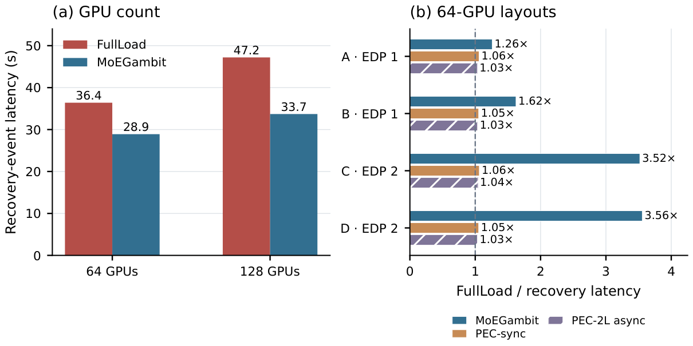</a></p>

MoC 的 PEC-sync、PEC 两级异步与 MoEGambit 共用各布局的 FullLoad 分母。
另一个 controlled-restart 端到端实验中，full-sync / PEC-sync / PEC 两级异步
的窗口耗时分别为 267.086 / 264.269 / 300.784 秒（每种一次运行）。
这些整窗口时间不能直接与上图不含 replay 的恢复加载耗时比较。

<details>
<summary><strong>完整 Hybrid 质量：训练阶段、rank 数与专家数量</strong></summary>

<p align="center"><a href="docs/assets/paper-results/quality_checkpoint_study.pdf">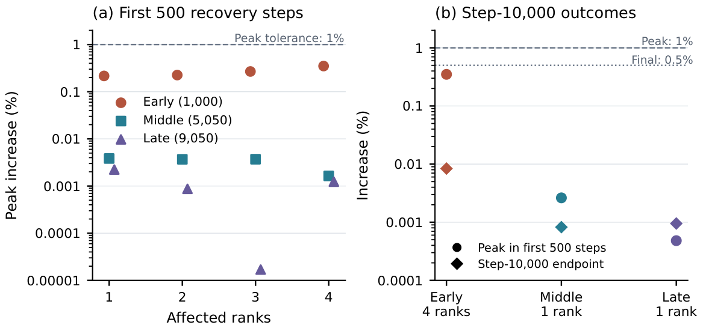</a></p>
<p align="center"><a href="docs/assets/paper-results/quality_full_state_500.pdf">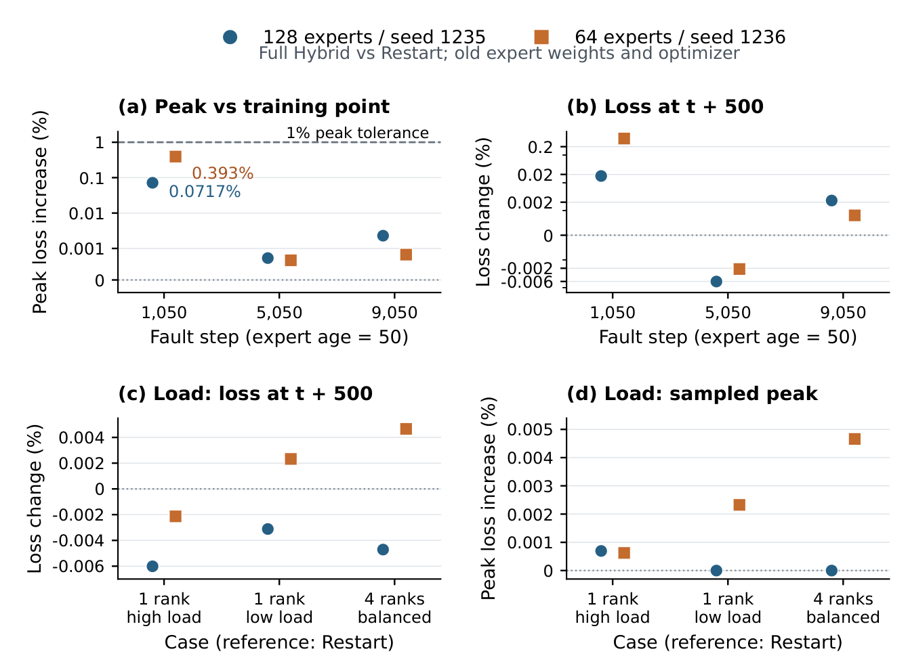</a></p>

这些实验使用完整状态恢复。500-step 终点描述短期变化；最终损失容忍度
在训练终点评估。旧专家 checkpoint 位于 200-step 的恢复网格上。

</details>

<details>
<summary><strong>完成质量、重复故障与不同 MoE 架构</strong></summary>

<p align="center"><a href="docs/assets/paper-results/quality_full_state_terminal.pdf">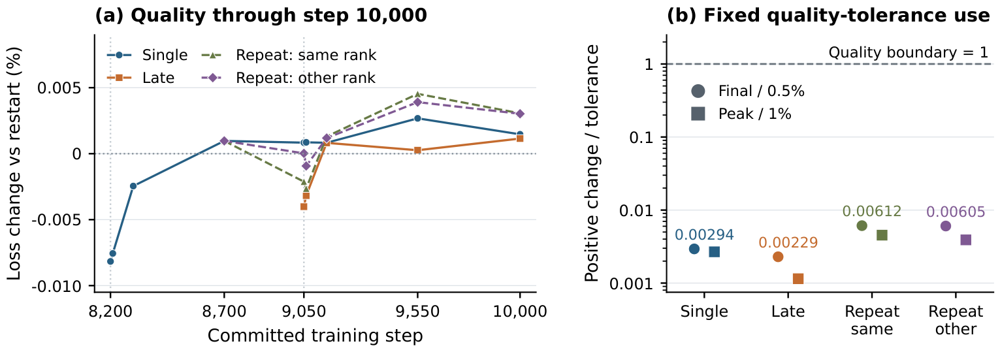</a></p>
<p align="center"><a href="docs/assets/paper-results/quality_architecture_transfer.pdf">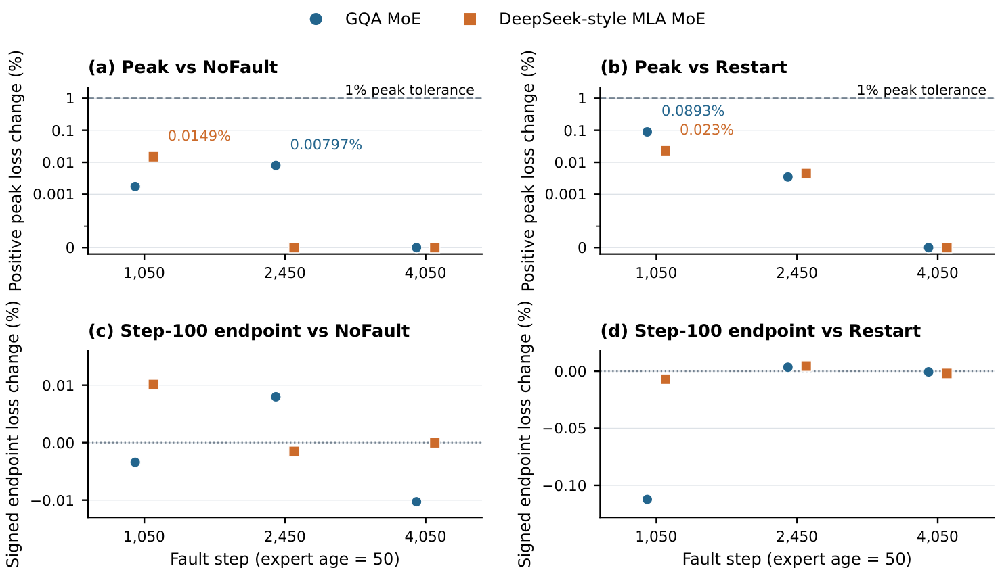</a></p>

统一容忍度为最终损失退化 **0.5%**、采样峰值退化 **1%**，整场风险预算
**α_run=0.05**，准入条件为 **R≤1**。架构比较同时改变了 shared expert、
路由及层布局，不能解释成只改变 attention 的消融。短窗口与共享前缀实验
用于报告轨迹质量，与独立整场风险审计分开。

</details>

<details>
<summary><strong>R2：候选决策与整场风险</strong></summary>

<p align="center"><a href="docs/assets/paper-results/r2_audit.pdf">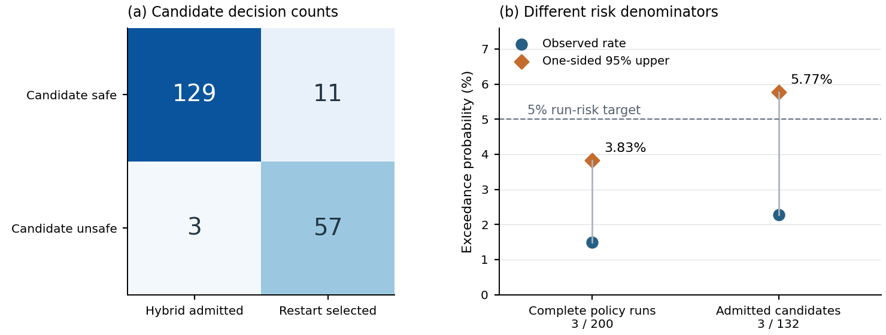</a></p>

实际策略轨迹在 200 次完整运行中有 3 次越界，单侧 95% 精确上界为
**3.83%**。获准候选中有 3/132 越界，对应上界为 **5.77%**。
两者分母不同：前者在审计条件下支持 5% 的边际整场风险目标，后者不能
认证 5% 的准入条件风险目标。公开导出包含作者报告的计数及审计条件确认，
未包含 200 次逐运行原始记录或训练好的预测器包。

</details>

<details>
<summary><strong>10k 训练与十次故障</strong></summary>

<p align="center"><a href="docs/assets/paper-results/train_loss.pdf">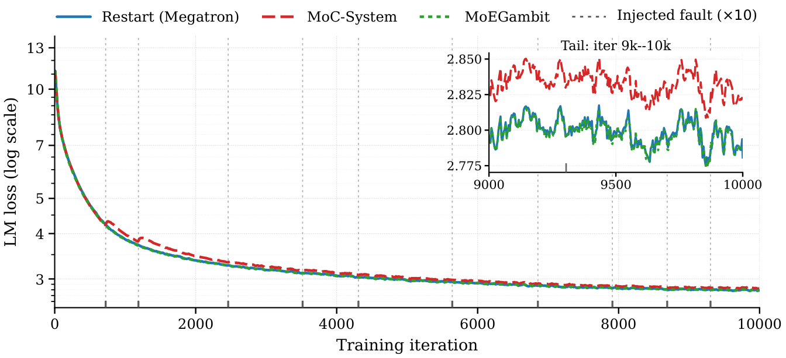</a></p>

Restart / MoEGambit / MoC PEC 最后 200 step 的平均训练 loss 为
**2.7919 / 2.7910 / 2.8254**。论文报告了完整端到端执行，MoEGambit 分支
使用 R2 决策。训练 loss 是稳定性诊断；质量边界使用固定验证集 loss 评估。

</details>

### 恢复为何更快：机制消融与跨模型收益

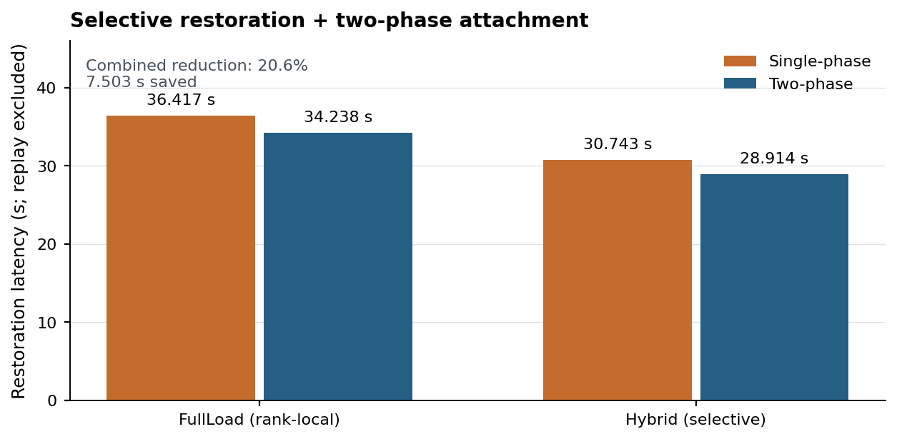

[查看矢量 PDF](docs/assets/paper-results/restoration_ablation.pdf)
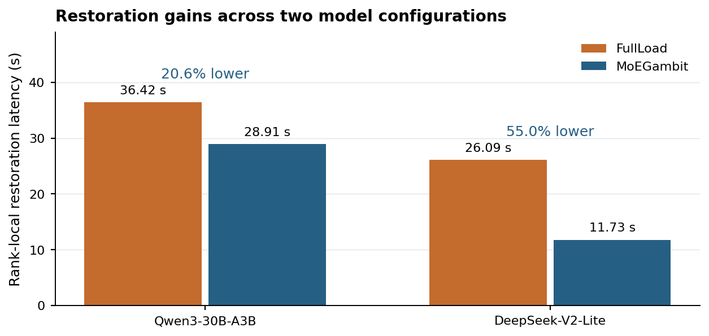

[查看矢量 PDF](docs/assets/paper-results/cross_model_restoration.pdf)

选择性恢复和两阶段加载相对单阶段 FullLoad 共节省 **7.503 秒（20.6%）**。
平衡 2×2 对比中，选择性恢复的边际差为 **5.50 秒**，加载阶段的边际差为
**2.00 秒**；DeepSeek-V2-Lite 配置降低 **55.0%**。这些图展示不含 replay
的实验单元均值，与包含 replay 的 35.6× 是不同口径。


### 突发故障质量：专家年龄不能单独解释恢复结果

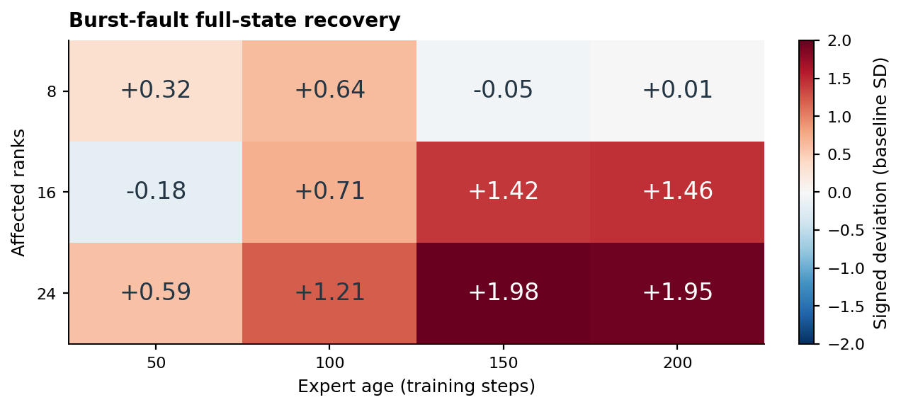

[查看矢量 PDF](docs/assets/paper-results/burst_quality.pdf)

专家年龄为 50 step 时，各格均值均在一个基线标准差以内；年龄为
150～200 step 时，16/24-rank 实验格达到 **1.42～1.98 个基线标准差**。
图中是以**基线标准差**为单位的带符号验证损失偏差，不是相对 loss 百分比，
也不是 R2 风险分数。同样的专家年龄在不同 rank 数下产生不同偏差，支持
在决策中使用年龄以外的特征。


### 第 10,000 step 的下游任务结果

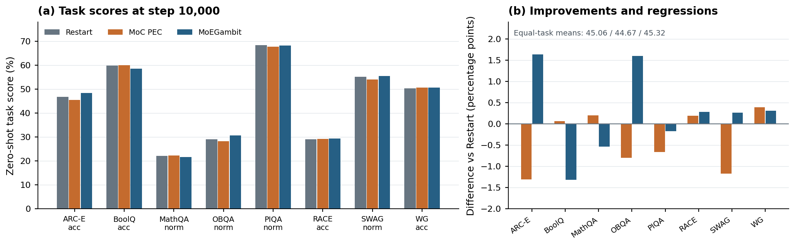

[查看矢量 PDF](docs/assets/paper-results/downstream_accuracy.pdf)

Restart / MoC PEC / MoEGambit 的任务等权均值为
**45.06% / 44.67% / 45.32%**，PEC 保留 128 个专家中的 16 个。
右图用百分点展示相对 Restart 的变化，
同时保留改善与退化。均值按各任务指定的 `acc` 或 `acc_norm` 计算，
不是将所有样本合并的准确率，也不据此声称统计显著提升。


### 完整控制路径开销与 MoC 端到端窗口

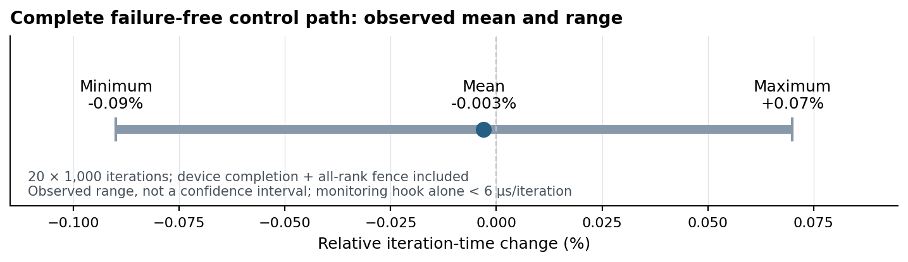

[查看矢量 PDF](docs/assets/paper-results/control_path_overhead.pdf)
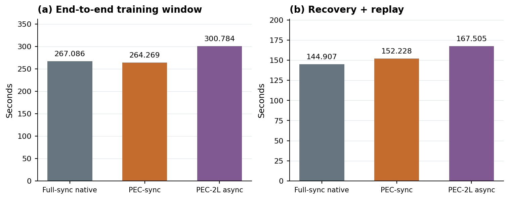

[查看矢量 PDF](docs/assets/paper-results/moc_controlled_restart.pdf)

开销图只展示报告的**均值与观测范围**，不生成 20 个重复样本点，也不把范围
视作置信区间。`<6 µs` 只描述监控 hook；iteration 耗时比较覆盖完整无故障
控制路径。MoC 图将完整训练窗口与恢复加 replay 分开，每种方案为一次运行、
一个故障 rank，展示观测耗时，不据此推断统计显著性。


### 脚本与复核入口

[**论文图表与结果复核说明**](examples/paper_results/README.md) 为每项结果
列出输入、脚本、对照及测量范围，包含配对损失一致性检查、风险上界精确
计算，以及恢复、质量、重复故障和架构比较图的重绘脚本：

```bash
python -m pip install matplotlib numpy
export PAPER_RESULTS_DIR=/personal/moegambit/paper_results
mkdir -p "$PAPER_RESULTS_DIR"
nohup bash examples/paper_results/run_paper_results.sh \
  >> "$PAPER_RESULTS_DIR/reproduce.log" 2>&1 &
```

此命令只使用 CPU，图表、报告及逐阶段日志均写入 `$PAPER_RESULTS_DIR`，
不会重新启动训练。真实 GPU 实验入口见
[MoC 保存/恢复计时与端到端脚本](examples/moc_system/README.md)、
[Megatron 热替换示例](#多机运行示例) 和
[DeepSpeed MoE/dense 示例](examples/deepspeed/run_hot_spare.sh)。
[状态、运行完成及风险审计工具](docs/ARTIFACT_AUDIT.md) 用于核查新记录的证据。
结果导出未附带论文专用的 checkpoint 拼接训练启动器和训练好的 R2 预测器；
重绘成功不代表新配置下的训练复现已经完成。

## 环境与配置

### 环境要求

- Linux x86_64；
- Python 3.10+；
- NVIDIA GPU，以及兼容的 CUDA 版 PyTorch；
- active 与 spare 节点均可使用 NCCL；
- Megatron 示例需要 Transformer Engine；
- Qwen3-MoE DeepSpeed workload 需要 `transformers>=5.0.0,<6`；
- 所有节点共享数据集和 checkpoint，或使用完全相同的挂载路径；
- 主机内存足以容纳 optimizer replica 和预取 expert state。

必要依赖集合：

| 组件 | 必要依赖 |
| --- | --- |
| MoEGambit runtime | Python `>=3.10`；带 `torch.distributed` 的 PyTorch；GPU 作业需要 NCCL |
| Megatron-LM 0.15.3 | `torch>=2.6.0`、`numpy<2.0.0`、`packaging>=24.2`、Transformer Engine；编译可选 dataset helper 时需要 `pybind11` 和 C++17 编译器 |
| 仓库内 Megatron workload | `sentencepiece`、`tiktoken`、Hugging Face 兼容 tokenizer 目录以及 CUDA/NCCL |
| DeepSpeed 0.19.3 | `torch>=2.0.0`、`einops`、`hjson`、`msgpack`、`ninja`、`numpy`、`packaging>=20.0`、`psutil`、`py-cpuinfo`、`pydantic>=2.0.0`、`tqdm` |
| 仓库内 DeepSpeed Qwen3-MoE workload | `transformers>=5.0.0,<6`、`accelerate`、CUDA/NCCL，以及本地 `./DeepSpeed` 安装 |
| 开发检查 | `pytest>=7.0` |

### 已验证软件栈

你提供的环境快照对应以下集群软件栈：

| 软件包/runtime | 已验证版本 |
| --- | --- |
| PyTorch | `2.6.0+cu126` |
| CUDA runtime | `12.6.77` |
| NCCL | `2.21.5` |
| NumPy | `1.26.4` |
| Transformer Engine | `2.4.0.dev0+3b411e79` |
| Triton | `3.2.0` |
| Accelerate | `1.10.1` |
| Einops | `0.8.1` |
| HJSON / msgpack | `3.1.0` / `1.1.0` |
| Ninja / pybind11 / Cython | `1.11.1.4` / `2.11.1` / `3.0.12` |
| Packaging / psutil / py-cpuinfo | `24.2` / `7.0.0` / `9.0.0` |
| Pydantic / tqdm | `2.10.3` / `4.67.1` |
| sentencepiece / tiktoken | `0.2.1` / `0.7.0` |

该快照采集于框架升级之前，其中包含 `transformers==4.45.0` 和
`deepspeed==0.16.2`。这两个版本**不是**本仓库的目标运行版本。必须先将
Transformers 升级到 `>=5.0.0,<6`，再安装仓库中的 `./DeepSpeed` 源码，
确保 `deepspeed.__version__` 最终为 `0.19.3`。

环境快照中的 `flash_attn`、`grouped_gemm`、`megablocks`、`torchvision`
和 `torchaudio` 不是当前恢复脚本的强制依赖。仅当所选模型或 kernel 路径
需要它们时再安装。

项目不会固定一套适用于所有集群的 CUDA PyTorch wheel。复现上述环境时使用
CUDA 12.6 对应构建；在其他集群上则应安装彼此兼容的 PyTorch、CUDA 与 NCCL。

完成所有 editable install 后，验证最终生效的环境：

```bash
python - <<'PY'
from packaging.version import Version
import deepspeed
import numpy
import torch
import transformers

assert Version(torch.__version__.split("+", 1)[0]) >= Version("2.6.0")
assert Version(transformers.__version__) >= Version("5.0.0")
assert Version(transformers.__version__) < Version("6")
assert Version(deepspeed.__version__) >= Version("0.19.3")
assert Version(numpy.__version__) < Version("2.0.0")
assert torch.cuda.is_available()
assert torch.distributed.is_available()
print(
    f"torch={torch.__version__} cuda={torch.version.cuda} "
    f"deepspeed={deepspeed.__version__} "
    f"transformers={transformers.__version__} numpy={numpy.__version__}"
)
PY
```

### 示例路径

以下为脱敏后的示例路径，不代表仓库附带数据或已有集群。
请在所有训练节点和备用节点设置一致的共享挂载路径：

```text
dataset:
  /shared/moegambit/data/train_text_document

Megatron checkpoint:
  /shared/moegambit/checkpoints/megatron

Megatron logs:
  /shared/moegambit/logs/megatron

DeepSpeed run root:
  /shared/moegambit/runs/deepspeed
```

可通过 `DATA_PATH`、`TOKENIZER_DIR`、`MODEL_CONFIG`、`CKPT_DIR`、
`TRAIN_LOG_DIR` 或 `RUN_ROOT` 覆盖。Megatron mmap 数据集同时需要
`${DATA_PATH}.idx` 和 `${DATA_PATH}.bin`。

### 网络端口

| 用途 | 默认值 |
| --- | ---: |
| Megatron rendezvous | `20117` |
| Megatron watcher | `20200` |
| DeepSpeed rendezvous | `20121` |
| DeepSpeed hot-spare coordinator | `MASTER_PORT + 100` |
| optimizer replica | 通常从 `20300` 开始 |

多机任务不得广播 `127.0.0.1`。

## Runtime CLI

根目录兼容入口会根据 adapter 分发。不指定 `--adapter` 时，保持历史
Megatron 行为：

```bash
python elastic_launcher.py --adapter megatron \
  --nproc-per-node 8 --nnodes 8 --node-rank "${NODE_RANK}" \
  --master-addr "${MASTER_ADDR}" --master-port 20117 \
  -- python Megatron-LM/pretrain_gpt.py ...

python elastic_watcher.py --adapter megatron \
  --port 20200 --training-nnodes 8 --nproc-per-node 8 \
  --master-addr "${MASTER_ADDR}" --master-port 20117
```

DeepSpeed 的 launcher 运行在 active 节点，watcher 运行 coordinator 和常驻
spare agent：

```bash
# Active nodes 0-7
python elastic_launcher.py --adapter deepspeed \
  --coordinator-host "${SPARE_ADDR}" --coordinator-port 20221 \
  --run-id ds-run-001 --training-nodes 8 --spare-node 8 \
  --physical-node "${NODE_RANK}" --local-world-size 8 \
  --base-master-port 20121 --rank-hot-swap \
  -- python -m deepspeed.launcher.runner ...

# Spare node 8
python elastic_watcher.py --adapter deepspeed \
  --coordinator-host "${SPARE_ADDR}" --coordinator-port 20221 \
  --listen-host 0.0.0.0 --run-id ds-run-001 \
  --training-nodes 8 --spare-node 8 --physical-node 8 \
  --local-world-size 8 --base-master-port 20121 --rank-hot-swap \
  -- python -m deepspeed.launcher.runner ...
```

## 验证与成功标准

成功的 rank 替换必须满足：

- 在配置的 step 写入 fault marker；
- survivor Python 进程没有重启；
- replacement 保持故障进程原有的 logical rank；
- 所有进程组使用同一 manifest 重建；
- 按恢复契约选择的 committed version 恢复训练；
- 第一个完整的恢复后 iteration 成功提交；
- 最终 `global_step` 等于 `TRAIN_ITERS`。

启用 ZeRO-2 时，DeepSpeed 还会在所选 run-state 目录下写入
`completed.json` 并验证 optimizer replica version。

开发检查：

```bash
bash -n \
  examples/megatron/run_hot_spare.sh \
  examples/megatron/run_dense.sh \
  examples/deepspeed/run_hot_spare.sh \
  examples/deepspeed/run_dense.sh \
  test_hotspare_replace.sh \
  test_deepspeed_hotspare_replace.sh

python -m py_compile examples/deepspeed/dense_workload.py
python -m compileall -q src
python -m pytest tests -q
git diff --check
```

CPU/GPU 冒烟测试、checkpoint 语义和 wheel 部署说明见
[验证与部署](docs/VALIDATION.md)。CPU 测试成功不代表多机 CUDA/NCCL 恢复已验证。

## 常见问题

<details>
<summary><strong>无法访问 watcher</strong></summary>

```bash
nc -vz <watcher-ip> 20200
nc -vz <rank-0-ip> 20117
```

检查路由和防火墙策略；跨节点通信不能使用 loopback 地址。
</details>

<details>
<summary><strong>NCCL 在恢复处理故障前退出</strong></summary>

Megatron 验证脚本使用：

```bash
export TORCH_NCCL_ASYNC_ERROR_HANDLING=0
export TORCH_NCCL_ENABLE_MONITORING=0
```

变更 PyTorch 或 NCCL 后，需要重新验证这些恢复路径配置。
</details>

<details>
<summary><strong>进程组重建时恢复卡住</strong></summary>

- 确认每个 survivor 都到达相同的 safe point；
- 确认所有节点使用完全相同的代码和环境；
- 检查进程组创建顺序和 timeout 日志；
- 设置 `NCCL_DEBUG=INFO` 和 `NCCL_DEBUG_SUBSYS=INIT,NET,ENV`；
- 确认 replacement 广播的是可路由 IPv4 地址。
</details>

<details>
<summary><strong>主机内存不足</strong></summary>

```bash
export MOEGAMBIT_ZERO2_BUFFER_SLOTS=1
export MOEGAMBIT_STANDBY_PREFETCH_MAX_GIB=64
export MOEGAMBIT_STANDBY_PACKED_EXPERT_CACHE=0
```
</details>

## 安全说明

控制面只应运行在可信训练网络中。请使用每个作业独立的 token，通过防火墙限制
watcher 和 replica 端口，并且不要将 watcher 直接暴露到公网。具体配置请参阅
`moegambit.config.SecurityConfig`。

## 引用

如果 MoEGambit 对你的工作有帮助，请引用配套论文：

```bibtex
@misc{moegambit,
  title  = {MoEGambit: Selective State Repair for
            Distributed Mixture-of-Experts Training},
  author = {MoEGambit Authors},
  year   = {2026},
  note   = {Software artifact},
  url    = {https://github.com/ZJUAntgroup/MoEGambit}
}
```

正式归档引用前，请使用最终发表信息替换 author 和 venue 占位内容。

## 许可证

MoEGambit 自有 runtime 代码使用根目录的
[Apache License 2.0](LICENSE)。内置的 Megatron-LM 与 DeepSpeed 源码保留
各自上游许可证和 notice。重新分发前，请检查 [LEGAL.md](LEGAL.md)、
[Megatron-LM/LICENSE](Megatron-LM/LICENSE) 和
[DeepSpeed/LICENSE](DeepSpeed/LICENSE)。
