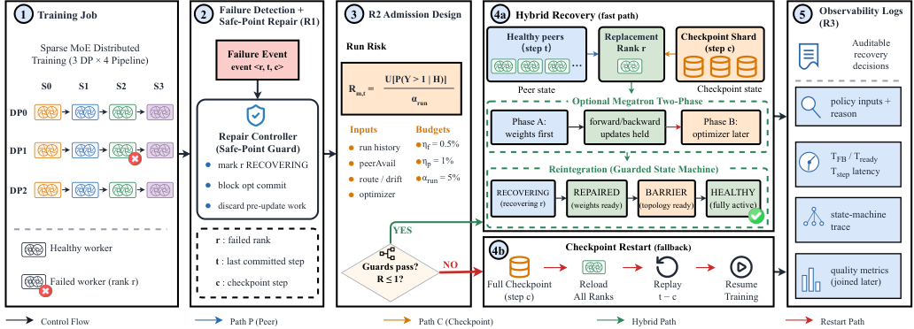
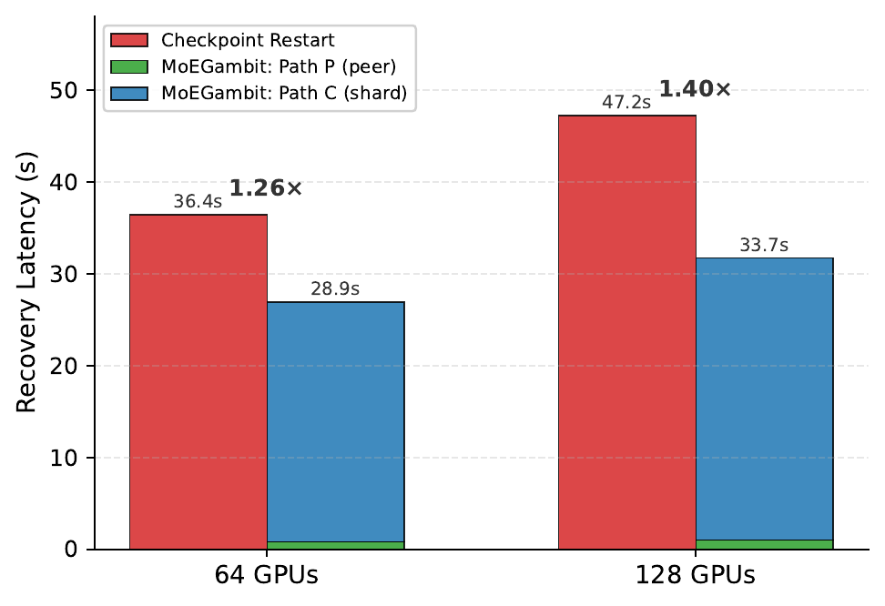
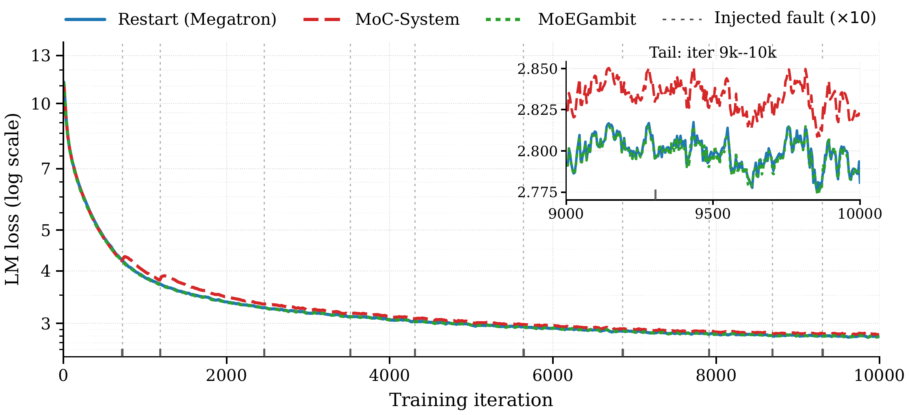

<div align="center">

<div style="margin: 20px 0;">
  
</div>

# MoEGambit

### Contract-Based Hybrid Recovery for Mixture-of-Experts Training

Framework-neutral hot rank replacement, version-aware state restoration, and
transactional recovery for Megatron-LM and DeepSpeed.

[](https://github.com/ZJUAntgroup/MoEGambit/stargazers)
[](LICENSE)
[](pyproject.toml)
[](Megatron-LM)
[](DeepSpeed)

[](README.md)
[](README-zh.md)

[Overview](#overview) · [Quick Start](#quick-start) ·
[Architecture](#architecture) · [Examples](#multi-node-examples) ·
[Recovery Contract](#recovery-contract) · [Paper Results](#paper-results)

<a href="docs/assets/moegambit-runtime-architecture.png">
  
</a>

<sub>Click the figure to open the full-resolution image.</sub>

</div>

## Overview

MoEGambit is the implementation accompanying
**“MoEGambit: Contract-Based Hybrid Recovery for Mixture-of-Experts
Training.”** It keeps the distributed training job alive after a fail-stop
rank failure, activates a resident replacement worker, rebuilds communication
groups in a deterministic order, and restores state from the safest available
source.

The key idea is hybrid recovery:

- replicated non-expert state is pulled from a healthy peer at the current
  committed version;
- rank-local expert state is restored from a checkpoint when no live expert
  replica exists;
- optimizer state can be restored from acknowledged host-memory replicas;
- unsafe or unprovable recovery paths fail closed to checkpoint relaunch.

MoEGambit separates recovery policy and orchestration from framework-specific
code. Megatron-LM and DeepSpeed retain only lifecycle hooks; their adapters
translate framework objects into one common recovery contract.

> [!IMPORTANT]
> MoEGambit is experimental research software. CPU tests validate contracts and
> state machines, but production use requires validation on the exact PyTorch,
> CUDA, NCCL, network, storage, and parallel topology of the target cluster.

## Highlights

- **One recovery runtime:** common controller, watcher protocol, policy,
  process-group orchestration, observability, and CLI under `src/moegambit/`.
- **Two framework adapters:** Megatron-LM and DeepSpeed use the same adapter
  boundary and the same launcher/watcher entry points.
- **Resident hot spares:** survivors keep their Python and CUDA processes while
  a spare assumes the failed logical rank.
- **Version-aware restoration:** model, optimizer, scheduler, RNG, data cursor,
  and checkpoint records are admitted only when their versions are compatible.
- **Phase-aware transactions:** failures in forward, backward, optimizer, and
  checkpoint publication have explicit replay or fallback semantics.
- **Bounded hybrid repair:** the paper R2 policy admits stale-expert recovery
  only while projected expert staleness density remains within its configured
  budget.
- **Fail-closed behavior:** MoEGambit never rewinds only an iteration counter
  after parameters may already have changed.

## Quick Start

### Install

Python 3.10 or newer is required. Install a CUDA-enabled PyTorch build that
matches the cluster before installing MoEGambit.

```bash
git clone https://github.com/ZJUAntgroup/MoEGambit.git
cd MoEGambit

python3 -m venv .venv
source .venv/bin/activate
python -m pip install --upgrade pip setuptools wheel

# Install the PyTorch wheel appropriate for the cluster first.
python -m pip install torch --index-url <PYTORCH_CUDA_WHEEL_INDEX>

# Install MoEGambit and its development checks.
python -m pip install -e '.[dev]'
```

Install the framework required by the workload. The packages below are the
required set for the supplied Megatron and DeepSpeed Qwen3-MoE examples:

```bash
# Megatron-LM
python -m pip install \
  'numpy<2.0.0' 'packaging>=24.2' \
  pybind11 Cython sentencepiece tiktoken
python -m pip install 'transformer-engine[pytorch]'
python -m pip install -e ./Megatron-LM

# DeepSpeed
python -m pip install -r deepspeed_requirements.txt
python -m pip install --upgrade 'transformers>=5.0.0,<6'
python -m pip install -e ./DeepSpeed
```

`deepspeed_requirements.txt` installs `accelerate`, `einops`, `hjson`,
`msgpack`, `ninja`, `numpy`, `packaging`, `psutil`, `py-cpuinfo`, `pydantic`,
`tqdm`, and `transformers`. The explicit upgrade is intentional:
`deepspeed_qwen3_moe_pretrain.py` and the DeepSpeed launch preflight require
`transformers>=5.0.0`. An environment that still contains
`transformers==4.45.0` will be rejected before the distributed job starts.

The repository scripts explicitly prefer the bundled framework sources:

```bash
export PYTHONPATH="$PWD/src:$PWD/DeepSpeed:$PWD/Megatron-LM${PYTHONPATH:+:$PYTHONPATH}"
```

### Verify

```bash
python - <<'PY'
import torch
import moegambit
import moegambit.adapters.deepspeed
from moegambit.runtime.discovery import discover_adapters

assert torch.cuda.is_available()
assert torch.distributed.is_available()
print("torch:", torch.__version__, "cuda:", torch.version.cuda)
print("moegambit:", moegambit.__file__)
print("adapters:", sorted(discover_adapters()))
PY

moegambit-doctor
python -m pytest tests -q
```

The package installs these commands:

| Command | Purpose |
| --- | --- |
| `moegambit-launch` | build or launch an adapter-selected training command |
| `moegambit-watch` | common watcher client entry point |
| `moegambit-watcher` | authenticated framework-neutral coordinator |
| `moegambit-doctor` | validate the local runtime environment |
| `moegambit-elastic-launcher` | compatibility launcher for Megatron/DeepSpeed |
| `moegambit-elastic-watcher` | compatibility watcher for Megatron/DeepSpeed |

## Architecture

```text
framework hook
      │
      ▼
EngineAdapter (Megatron / DeepSpeed / Generic DDP)
      │
      ├── framework lifecycle and state translation
      ▼
moegambit runtime + policy + control plane
      │
      ├── failure classification and recovery planning
      ├── spare assignment and topology manifest
      ├── deterministic process-group rebuild
      ├── peer / replica / checkpoint state selection
      └── commit, rollback, fallback, and observability
```

The dependency direction is strict:

```text
framework hook -> framework adapter -> moegambit interfaces/runtime/core
```

Framework-independent code must not be added back into `Megatron-LM/`,
`DeepSpeed/`, or either framework adapter. Megatron has one public integration
contract:

```python
from moegambit.adapters.megatron.hooks import megatron_hooks
```

Megatron publishes framework events and objects through that singleton.
Recovery configuration, failure classification, rollback/replay policy,
process-group rebuild state, and diagnostics live under
`src/moegambit/adapters/megatron/`.

For the detailed design, see
[Unified Recovery Architecture](docs/design/UNIFIED_RECOVERY_ARCHITECTURE.md).

### Repository layout

```text
.
├── src/moegambit/
│   ├── core/                  # framework-free contracts and decisions
│   ├── runtime/               # orchestration, hot spare, watcher client, protocol
│   ├── interfaces/            # EngineAdapter protocol
│   ├── adapters/
│   │   ├── megatron/          # Megatron state/topology integration
│   │   ├── deepspeed/         # DeepSpeed engine/ZeRO integration
│   │   └── generic_ddp/       # framework-neutral reference adapter
│   ├── control/               # authenticated control plane and frozen plans
│   ├── distributed/           # topology and c10d compatibility
│   └── replication/           # optimizer host-memory replication
├── Megatron-LM/               # Megatron Core 0.15.3 + minimal hooks
├── DeepSpeed/                 # DeepSpeed 0.19.3 + minimal hooks
├── examples/
│   ├── megatron/run_hot_spare.sh
│   ├── deepspeed/run_hot_spare.sh
│   └── generic_ddp/
├── elastic_launcher.py        # adapter-aware compatibility launcher
├── elastic_watcher.py         # adapter-aware compatibility watcher
├── test_hotspare_replace.sh
└── test_deepspeed_hotspare_replace.sh
```

### Adapter support

| Capability | Megatron-LM | DeepSpeed | Generic DDP |
| --- | :---: | :---: | :---: |
| Common launcher/watcher dispatch | ✓ | ✓ | reference |
| Resident rank replacement | ✓ | ✓ | worked example |
| Deterministic group rebuild | TP/PP/EP/DP | engine groups | DDP |
| Peer model-state restore | ✓ | ✓ | adapter contract |
| Host optimizer replication | distributed optimizer | ZeRO-2 | adapter contract |
| Checkpoint fallback | ✓ | ✓ | ✓ |
| Phase-aware transaction contract | ✓ | ✓ | ✓ |

## Recovery Contract

For a fail-stop event `<r, t, c>`—failed logical rank `r`, current iteration
`t`, and last checkpoint `c`—the recovery protocol is:

1. Freeze a recovery plan and increment the recovery epoch.
2. Mark the failed rank as `RECOVERING`, block optimizer commit, and discard
   the in-flight iteration.
3. Assign a physical spare while preserving the failed logical rank.
4. Rebuild all process groups from one canonical topology manifest.
5. Select compatible state sources by component and committed version.
6. Restore weights first; attach optimizer state under an update barrier.
7. Rewind the data cursor only when replay is required.
8. Execute one complete post-recovery iteration.
9. Commit the epoch and transition
   `RECOVERING → REPAIRED → BARRIER → HEALTHY`.

The R2 hybrid policy admits partial checkpoint restoration only when:

```text
Phi'(t) = (S(t) + |E_new| × Delta) / (N_expert × W_exp) <= Phi_max
```

where `Delta = t - c`, `S(t)` is accumulated stale-expert exposure,
`|E_new|` is the number of newly stale experts, and `W_exp` is the exposure
window. If the guard fails, the runtime selects a full checkpoint restart.

### Failure boundary semantics

The last committed optimizer version is distinct from the currently executing
iteration:

| Failure phase | Required recovery |
| --- | --- |
| forward, backward, optimizer-before | discard gradients, rewind data, and replay from the last committed step |
| optimizer-during | restore model and optimizer from the previous committed replica before replay |
| optimizer-after, replica not committed | checkpoint relaunch; bookkeeping-only rollback is forbidden |
| committed step | resume from that committed optimizer version |
| checkpoint before/while publishing commit record | ignore the incomplete checkpoint |
| checkpoint after commit record | allow the new checkpoint for restart |

An optimizer step is not advertised as safe until its host-memory peer replica
acknowledges the same version. If the adapter cannot prove the restoration
required for an optimizer-during failure, recovery aborts or falls back to a
checkpoint relaunch.

## Multi-node Examples

The supplied validation topology uses nine homogeneous nodes:

- nodes `0-7`: eight active GPUs each;
- node `8`: eight resident replacement workers;
- 64 logical ranks;
- fault injection at step `17`, after a checkpoint at step `10`.

Run the same script on every node and change only `NODE_RANK`. `MASTER_ADDR`
and `ELASTIC_WATCHER_ADDR` must be routable from every node.

### Megatron-LM

```bash
# Active nodes: run once with NODE_RANK=0, then 1 ... 7.
NODE_RANK=0 \
MASTER_ADDR=<node-0-routable-ip> \
ELASTIC_WATCHER_ADDR=<node-8-routable-ip> \
bash examples/megatron/run_hot_spare.sh

# Spare node.
NODE_RANK=8 \
MASTER_ADDR=<node-0-routable-ip> \
ELASTIC_WATCHER_ADDR=<node-8-routable-ip> \
bash examples/megatron/run_hot_spare.sh
```

The validated Megatron shape is PP=8, EP=8, TP=1. Common overrides:

```bash
export FAULT_INJECT_STEP=17
export FAULT_INJECT_NODE=0
export FAULT_INJECT_LOCAL_RANK=1
export TRAIN_ITERS=100
export SAVE_INTERVAL=10
export DATA_PATH=/mnt/ais-c1/dataset/zds/bigdata/my_qwen3_data_text_document
export CKPT_DIR=/mnt/ais-c1/dataset/zds/731hotspare/test_replace_ckpt
```

### DeepSpeed

```bash
# Active nodes: run once with NODE_RANK=0, then 1 ... 7.
NODE_RANK=0 \
MASTER_ADDR=<node-0-routable-ip> \
ELASTIC_WATCHER_ADDR=<node-8-routable-ip> \
TEST_MODE=hot_swap \
bash examples/deepspeed/run_hot_spare.sh

# Spare node.
NODE_RANK=8 \
MASTER_ADDR=<node-0-routable-ip> \
ELASTIC_WATCHER_ADDR=<node-8-routable-ip> \
TEST_MODE=hot_swap \
bash examples/deepspeed/run_hot_spare.sh
```

DeepSpeed validation modes:

| `TEST_MODE` | Topology | Behavior |
| --- | --- | --- |
| `hot_swap` | PP=8, EP=8, ZeRO-1 | replace one failed rank on node 8 |
| `zero2` | PP=1, EP=8, ZeRO-2 | replicate optimizer shards through D2H/TCP |
| `combined` | PP=1, EP=8, ZeRO-2 | rank replacement plus optimizer replication |
| `all` | sequential | run `hot_swap`, then `zero2` |

DeepSpeed `PipelineEngine` does not support ZeRO-2/3; this repository therefore
does not claim PP=8 plus ZeRO-2 support.

### Dry run

Generate commands without starting distributed workers:

```bash
DRY_RUN=1 NODE_RANK=0 \
MASTER_ADDR=10.0.0.1 ELASTIC_WATCHER_ADDR=10.0.0.9 \
bash examples/megatron/run_hot_spare.sh

DRY_RUN=1 TEST_MODE=all NODE_RANK=8 \
MASTER_ADDR=10.0.0.1 ELASTIC_WATCHER_ADDR=10.0.0.9 \
bash examples/deepspeed/run_hot_spare.sh
```

For multi-NIC hosts:

```bash
export MOEGAMBIT_HOT_SPARE_ADVERTISE_ADDR=<this-node-routable-ip>
export MOEGAMBIT_REPLICA_ADVERTISE_ADDR=<this-node-routable-ip>
```

### Generic DDP

The Generic DDP example shows that the recovery contract is not tied to either
vendored framework:

```bash
torchrun --standalone --nproc-per-node=2 \
  examples/generic_ddp/train_loop.py \
  --steps 8 \
  --checkpoint-dir /tmp/moegambit-generic-ddp
```

See [examples/generic_ddp/README.md](examples/generic_ddp/README.md) for the
fault-replacement walkthrough.

## Paper Results

The accompanying paper artifact reports **20.6%-55.0% lower raw recovery
latency** and a **36.9× replay-inclusive speedup** for a 100-iteration replay
gap. These figures use the paper's latency scope and should not be interpreted
as stronger end-to-end guarantees for other clusters.

<div align="center">
  <a href="docs/assets/scalability.png">
    
  </a>
  <p><em>Recovery latency at 64 and 128 GPUs. Path P is peer state; Path C is
  checkpoint expert state. Click the figure to view it at full resolution.</em></p>
</div>

<details>
<summary><strong>Training-loss comparison under injected faults</strong></summary>
<br>
<div align="center">
  <a href="docs/assets/training-loss.png">
    
  </a>
  <p><em>Loss trajectories for checkpoint restart, MoC-System, and
  MoEGambit. The dotted vertical markers denote injected faults. Click the
  figure to view it at full resolution.</em></p>
</div>
</details>

The paper's main setting uses Qwen3-30B-A3B on 64 NVIDIA H20 GPUs; the
cross-model setting uses DeepSeek-V2-Lite. Reproduce claims on a comparable
multi-node GPU environment before drawing performance conclusions.

## Environment and Configuration

### Environment requirements

- Linux x86_64;
- Python 3.10+;
- NVIDIA GPUs and a compatible CUDA-enabled PyTorch build;
- NCCL available on active and spare nodes;
- Transformer Engine for the supplied Megatron configuration;
- `transformers>=5.0.0,<6` for the Qwen3-MoE DeepSpeed workload;
- shared or identically mounted datasets and checkpoints;
- enough host memory for optimizer replicas and prefetched expert state.

Required dependency sets:

| Component | Required dependencies |
| --- | --- |
| MoEGambit runtime | Python `>=3.10`; PyTorch with `torch.distributed`; NCCL for GPU jobs |
| Megatron-LM 0.15.3 | `torch>=2.6.0`, `numpy<2.0.0`, `packaging>=24.2`, Transformer Engine; `pybind11` and a C++17 compiler for the optional dataset helper |
| Supplied Megatron workload | `sentencepiece`, `tiktoken`, a Hugging Face-compatible tokenizer directory, and CUDA/NCCL |
| DeepSpeed 0.19.3 | `torch>=2.0.0`, `einops`, `hjson`, `msgpack`, `ninja`, `numpy`, `packaging>=20.0`, `psutil`, `py-cpuinfo`, `pydantic>=2.0.0`, `tqdm` |
| Supplied DeepSpeed Qwen3-MoE workload | `transformers>=5.0.0,<6`, `accelerate`, CUDA/NCCL, and the local `./DeepSpeed` installation |
| Development checks | `pytest>=7.0` |

### Validated software stack

The provided environment snapshot corresponds to the following cluster stack:

| Package/runtime | Validated version |
| --- | --- |
| PyTorch | `2.6.0+cu126` |
| CUDA runtime | `12.6.77` |
| NCCL | `2.21.5` |
| NumPy | `1.26.4` |
| Transformer Engine | `2.4.0.dev0+3b411e79` |
| Triton | `3.2.0` |
| Accelerate | `1.10.1` |
| Einops | `0.8.1` |
| HJSON / msgpack | `3.1.0` / `1.1.0` |
| Ninja / pybind11 / Cython | `1.11.1.4` / `2.11.1` / `3.0.12` |
| Packaging / psutil / py-cpuinfo | `24.2` / `7.0.0` / `9.0.0` |
| Pydantic / tqdm | `2.10.3` / `4.67.1` |
| sentencepiece / tiktoken | `0.2.1` / `0.7.0` |

The snapshot was captured before the framework upgrade and contains
`transformers==4.45.0` and `deepspeed==0.16.2`. Those two versions are **not**
the target runtime for this repository. Upgrade Transformers to
`>=5.0.0,<6`, then install the bundled `./DeepSpeed` source so that
`deepspeed.__version__` resolves to `0.19.3`.

`flash_attn`, `grouped_gemm`, `megablocks`, `torchvision`, and `torchaudio`
appear in the source environment but are not mandatory for the supplied
recovery scripts. Install them only when the selected model or kernel path
requires them.

The project deliberately does not pin a universal CUDA-specific PyTorch wheel;
use the CUDA 12.6 build above to reproduce the supplied environment, or install
a mutually compatible PyTorch/CUDA/NCCL stack for another cluster.

Verify the effective environment after all editable installs:

```bash
python - <<'PY'
from packaging.version import Version
import deepspeed
import numpy
import torch
import transformers

assert Version(torch.__version__.split("+", 1)[0]) >= Version("2.6.0")
assert Version(transformers.__version__) >= Version("5.0.0")
assert Version(transformers.__version__) < Version("6")
assert Version(deepspeed.__version__) >= Version("0.19.3")
assert Version(numpy.__version__) < Version("2.0.0")
assert torch.cuda.is_available()
assert torch.distributed.is_available()
print(
    f"torch={torch.__version__} cuda={torch.version.cuda} "
    f"deepspeed={deepspeed.__version__} "
    f"transformers={transformers.__version__} numpy={numpy.__version__}"
)
PY
```

### Validated paths

The example scripts intentionally retain the cluster paths used during current
validation:

```text
dataset:
  /mnt/ais-c1/dataset/zds/bigdata/my_qwen3_data_text_document

Megatron checkpoint:
  /mnt/ais-c1/dataset/zds/731hotspare/test_replace_ckpt

Megatron logs:
  /mnt/ais-c1/dataset/zds/log/test_replace

DeepSpeed run root:
  /mnt/ais-c1/dataset/zds/89hotspare/deepspeed_real
```

Override them with `DATA_PATH`, `TOKENIZER_DIR`, `MODEL_CONFIG`, `CKPT_DIR`,
`TRAIN_LOG_DIR`, or `RUN_ROOT`. The Megatron mmap dataset requires both
`${DATA_PATH}.idx` and `${DATA_PATH}.bin`.

### Network ports

| Purpose | Default |
| --- | ---: |
| Megatron rendezvous | `20117` |
| Megatron watcher | `20200` |
| DeepSpeed rendezvous | `20121` |
| DeepSpeed hot-spare coordinator | `MASTER_PORT + 100` |
| optimizer replicas | normally starts at `20300` |

Do not advertise `127.0.0.1` for multi-node jobs.

## Runtime CLI

The root compatibility entry points dispatch by adapter. Omitting `--adapter`
retains historical Megatron behavior:

```bash
python elastic_launcher.py --adapter megatron \
  --nproc-per-node 8 --nnodes 8 --node-rank "${NODE_RANK}" \
  --master-addr "${MASTER_ADDR}" --master-port 20117 \
  -- python Megatron-LM/pretrain_gpt.py ...

python elastic_watcher.py --adapter megatron \
  --port 20200 --training-nnodes 8 --nproc-per-node 8 \
  --master-addr "${MASTER_ADDR}" --master-port 20117
```

For DeepSpeed, the launcher runs on active nodes and the watcher runs the
coordinator plus resident spare agent:

```bash
# Active nodes 0-7
python elastic_launcher.py --adapter deepspeed \
  --coordinator-host "${SPARE_ADDR}" --coordinator-port 20221 \
  --run-id ds-run-001 --training-nodes 8 --spare-node 8 \
  --physical-node "${NODE_RANK}" --local-world-size 8 \
  --base-master-port 20121 --rank-hot-swap \
  -- python -m deepspeed.launcher.runner ...

# Spare node 8
python elastic_watcher.py --adapter deepspeed \
  --coordinator-host "${SPARE_ADDR}" --coordinator-port 20221 \
  --listen-host 0.0.0.0 --run-id ds-run-001 \
  --training-nodes 8 --spare-node 8 --physical-node 8 \
  --local-world-size 8 --base-master-port 20121 --rank-hot-swap \
  -- python -m deepspeed.launcher.runner ...
```

## Validation and Success Criteria

A successful rank replacement must show:

- a fault marker at the configured step;
- survivor Python processes were not restarted;
- the replacement retained the failed logical rank;
- every process group rebuilt from the same manifest;
- recovery resumed at the contract-selected committed version;
- the first complete post-recovery iteration committed;
- the final `global_step` equals `TRAIN_ITERS`.

DeepSpeed also writes `completed.json` below the selected run-state directory
and validates optimizer replica versions when ZeRO-2 is enabled.

Development checks:

```bash
bash -n \
  examples/megatron/run_hot_spare.sh \
  examples/deepspeed/run_hot_spare.sh \
  test_hotspare_replace.sh \
  test_deepspeed_hotspare_replace.sh

python -m compileall -q src
python -m pytest tests -q
git diff --check
```

## Troubleshooting

<details>
<summary><strong>Watcher is unreachable</strong></summary>

```bash
nc -vz <watcher-ip> 20200
nc -vz <rank-0-ip> 20117
```

Check routing and firewall policy; never use loopback addresses between nodes.
</details>

<details>
<summary><strong>NCCL aborts before recovery handles the failure</strong></summary>

The Megatron validation script uses:

```bash
export TORCH_NCCL_ASYNC_ERROR_HANDLING=0
export TORCH_NCCL_ENABLE_MONITORING=0
```

Revalidate these recovery-path settings when changing PyTorch or NCCL.
</details>

<details>
<summary><strong>Recovery hangs during group rebuild</strong></summary>

- confirm every survivor reached the same safe point;
- confirm every node uses identical code and environment;
- inspect group creation order and timeout logs;
- set `NCCL_DEBUG=INFO` and `NCCL_DEBUG_SUBSYS=INIT,NET,ENV`;
- confirm the replacement advertises a routable IPv4 address.
</details>

<details>
<summary><strong>Host memory is exhausted</strong></summary>

```bash
export MOEGAMBIT_ZERO2_BUFFER_SLOTS=1
export MOEGAMBIT_STANDBY_PREFETCH_MAX_GIB=64
export MOEGAMBIT_STANDBY_PACKED_EXPERT_CACHE=0
```
</details>

## Security

The control plane is designed for a trusted training network. Use a per-job
token, restrict watcher and replica ports with firewall rules, and never expose
the watcher directly to the public Internet. See
`moegambit.config.SecurityConfig`.

## Citation

If you use MoEGambit, please cite the accompanying paper:

```bibtex
@misc{moegambit,
  title  = {MoEGambit: Contract-Based Hybrid Recovery for
            Mixture-of-Experts Training},
  author = {MoEGambit Authors},
  year   = {2026},
  note   = {Software artifact},
  url    = {https://github.com/ZJUAntgroup/MoEGambit}
}
```

Replace the placeholder author and venue fields with the final publication
metadata before archival citation.

## License

MoEGambit-owned runtime code is licensed under the root
[Apache License 2.0](LICENSE). Vendored Megatron-LM and DeepSpeed sources retain
their upstream licenses and notices. Review [LEGAL.md](LEGAL.md),
[Megatron-LM/LICENSE](Megatron-LM/LICENSE), and
[DeepSpeed/LICENSE](DeepSpeed/LICENSE) before redistribution.
