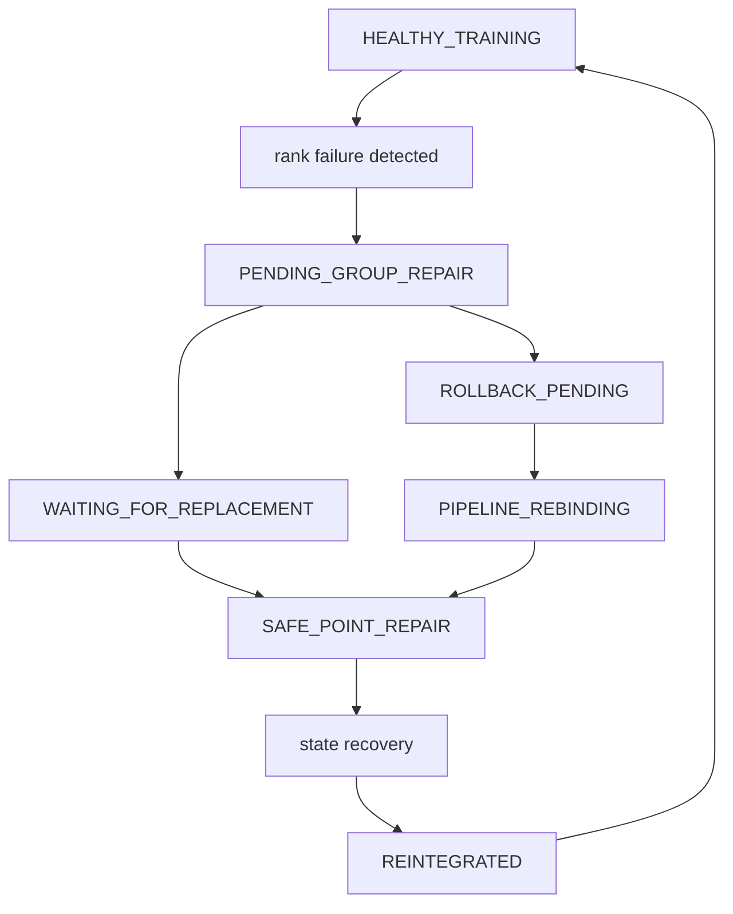

# MoEGambit 项目导读：热替换、混合恢复与 ZeRO-2

本文面向第一次阅读 MoEGambit 代码的读者，目标是把项目整体结构、故障后的热替换流程、混合状态恢复路径，以及 ZeRO-2 在本项目中的位置串起来。建议阅读本文时同时打开代码，因为本文会尽量用模块和函数作为锚点，而不是只描述概念。

## 1. 项目整体结构

MoEGambit 是基于 Megatron-LM 的 MoE 训练容错实验原型。核心思想是：当某个训练 rank 发生 fail-stop 故障时，系统尽量不要重启整个 job，而是在安全点引入替换 rank，恢复它需要的模型和优化器状态，再让它重新加入训练。

仓库中的主要目录可以这样理解：

| 路径 | 作用 |
| --- | --- |
| [`docs/architecture.md`](architecture.md) | engine-neutral runtime 和 adapter 设计说明，是理解最新顶层架构的短入口。 |
| [`src/moegambit`](../src/moegambit) | 与训练引擎无关的核心 contract、policy、runtime、CLI 和 watcher protocol。 |
| [`src/moegambit_megatron`](../src/moegambit_megatron) | Megatron adapter，把 runtime feature 映射到 Megatron/elastic 环境和命令行。 |
| [`src/moegambit_deepspeed`](../src/moegambit_deepspeed) | DeepSpeed adapter 雏形，展示同一套 runtime contract 如何接其他训练引擎。 |
| [`src/Megatron-LM`](../src/Megatron-LM) | 修改后的 Megatron-LM 代码，MoEGambit 的主要实现都在这里。 |
| [`src/Megatron-LM/megatron/core/transformer/moe`](../src/Megatron-LM/megatron/core/transformer/moe) | MoE 热替换、专家恢复、两阶段恢复、热备池等核心逻辑。 |
| [`src/Megatron-LM/megatron/core/optimizer`](../src/Megatron-LM/megatron/core/optimizer) | Megatron 分布式优化器实现，也就是理解 ZeRO-2 风格分片的关键位置。 |
| [`src/Megatron-LM/megatron/training`](../src/Megatron-LM/megatron/training) | 训练主流程、参数开关、checkpoint 加载和 MoEGambit hook 接入点。 |
| [`src/elastic`](../src/elastic) | 弹性训练、故障注入、恢复控制相关的辅助代码。 |
| [`scripts`](../scripts) | 运行实验、解析日志、复现实验结果的脚本。 |
| [`data/logs/evaluation`](../data/logs/evaluation) | 论文实验日志和评估输入数据。 |

最应该先读的入口文件是：

| 文件 | 建议阅读点 |
| --- | --- |
| [`docs/architecture.md`](architecture.md) | 最新 runtime/adapter 分层、feature switch 和 engine-neutral 约束。 |
| [`src/moegambit/core/contracts.py`](../src/moegambit/core/contracts.py) | `FeatureSwitches`、`FailureEvent`、`RecoveryContext`、`RecoveryDecision` 等稳定数据契约。 |
| [`src/moegambit/runtime/config.py`](../src/moegambit/runtime/config.py) | `MOEGAMBIT_HOT_SWAP`、`MOEGAMBIT_ZERO2` 和兼容环境变量的投影规则。 |
| [`src/moegambit/runtime/launcher.py`](../src/moegambit/runtime/launcher.py) | 通过 adapter 准备和启动训练命令。 |
| [`src/moegambit_megatron/__init__.py`](../src/moegambit_megatron/__init__.py) | Megatron adapter 如何自动加 `--use-distributed-optimizer` 并设置 elastic 环境。 |
| [`recovery_controller.py`](../src/Megatron-LM/megatron/core/transformer/moe/recovery_controller.py) | 故障恢复状态机，决定什么时候分组修复、什么时候恢复状态、什么时候重新集成。 |
| [`hot_spare_pool.py`](../src/Megatron-LM/megatron/core/transformer/moe/hot_spare_pool.py) | 热备 rank 的生命周期管理。热备 rank 初始不属于训练 NCCL world。 |
| [`replacement_registry.py`](../src/Megatron-LM/megatron/core/transformer/moe/replacement_registry.py) | 替换 rank 的注册、ready、integrated 状态记录。 |
| [`dense_param_sync.py`](../src/Megatron-LM/megatron/core/transformer/moe/dense_param_sync.py) | 从健康 DP peer 拉取 dense/shared/router 参数和部分优化器状态。 |
| [`stale_expert_restore.py`](../src/Megatron-LM/megatron/core/transformer/moe/stale_expert_restore.py) | 从 checkpoint 恢复本 rank 拥有的 expert 参数。 |
| [`two_phase_recovery.py`](../src/Megatron-LM/megatron/core/transformer/moe/two_phase_recovery.py) | expert 权重先恢复、optimizer state 后恢复的两阶段协议。 |
| [`deferred_optimizer_load.py`](../src/Megatron-LM/megatron/core/transformer/moe/deferred_optimizer_load.py) | 后台或延迟加载 expert optimizer state，并用 barrier 阻止状态未恢复的 expert 被更新。 |
| [`moegambit_integration.py`](../src/Megatron-LM/megatron/core/transformer/moe/moegambit_integration.py) | 把 MoEGambit recovery 模块接到 Megatron 训练流程中的胶水层。 |
| [`training.py`](../src/Megatron-LM/megatron/training/training.py) | 训练循环中的 hook，包括 replacement rank 加载、参数同步、optimizer step guard。 |
| [`arguments.py`](../src/Megatron-LM/megatron/training/arguments.py) | MoEGambit 和 distributed optimizer/ZeRO 相关命令行参数。 |
| [`distrib_optimizer.py`](../src/Megatron-LM/megatron/core/optimizer/distrib_optimizer.py) | Megatron DistributedOptimizer，即 ZeRO-2 风格 optimizer/gradient sharding 的核心实现。 |
| [`zero2_memory_checkpoint.py`](../src/Megatron-LM/megatron/training/zero2_memory_checkpoint.py) | PHOENIX-style host-memory optimizer shard replication，用于 ZeRO-2 恢复。 |

当前代码有两层架构：

1. `src/moegambit` 是 engine-neutral runtime，不直接 import Torch、Megatron 或 DeepSpeed。它只定义 contract、policy、feature switch、watcher protocol 和 adapter 发现机制。
2. `src/Megatron-LM` 和 `src/elastic` 是 Megatron 具体后端，拥有 rank group、optimizer shard、MoE expert、checkpoint 等训练引擎细节。

这个分层让恢复策略可以在不依赖 CUDA 的情况下测试，同时在真正执行热替换时仍然能访问 Megatron 的 model-parallel group、MoE expert placement 和 distributed optimizer 元数据。

## 2. 一句话理解 MoEGambit

普通 checkpoint restart 是把整个训练 job 从某个 checkpoint 重新拉起。MoEGambit 想做得更细：只让失败 rank 的替代者补齐它缺失的状态，然后继续从接近当前的 iteration 训练。

这件事被拆成三个层面：

1. 控制面：发现 rank 故障，暂停在安全点，分配替换 rank，重建必要通信关系。
2. 状态面：恢复替换 rank 的 dense 参数、expert 参数、optimizer state、RNG 等状态。
3. 提交面：在状态没有完全合法前，禁止错误的 optimizer step 污染训练。

对应到代码就是：

```text
fault detected
  -> RecoveryController enters repair phase
  -> HotSparePool allocates a replacement rank
  -> ReplacementRegistry records replacement lifecycle
  -> process groups/topology are repaired at safe point
  -> dense/shared/router state is pulled from healthy DP peer
  -> expert state is restored from checkpoint or expert DP peer
  -> optimizer commit guard protects invalid iteration
  -> replacement rank is reintegrated
```

## 3. 热替换状态机

热替换不是在任意代码位置直接替换 communicator，而是由 [`RecoveryController`](../src/Megatron-LM/megatron/core/transformer/moe/recovery_controller.py) 驱动状态机，在安全点执行。

核心 phase 在 `RecoveryPhase` 中定义，主要包括：

| Phase | 含义 |
| --- | --- |
| `HEALTHY_TRAINING` | 正常训练。 |
| `PENDING_GROUP_REPAIR` | 已检测到故障，需要修复 rank group。 |
| `WAITING_FOR_REPLACEMENT` | 等待替换 rank 被分配并启动。 |
| `SAFE_POINT_REPAIR` | 到达安全点，执行 communicator/group/topology 修复和状态恢复。 |
| `REINTEGRATED` | 替换 rank 已恢复并重新加入训练。 |
| `ROLLBACK_PENDING` | pipeline parallel 场景下可能需要 rollback。 |
| `PIPELINE_REBINDING` | pipeline stage 映射和 communicator 重新绑定。 |

可以用下面的流程图概括：



关键入口是 `RecoveryController.on_hard_rank_failure(...)`。它会记录失败 rank、当前 iteration、替换策略，并根据协议选择普通热备替换或 restart-in-place 模式。

### 3.1 热备 rank 为什么不直接参与 NCCL world

[`hot_spare_pool.py`](../src/Megatron-LM/megatron/core/transformer/moe/hot_spare_pool.py) 的注释和实现强调一个设计点：daemon 模式下的 spare ranks 初始在训练 world 外部，不参加训练 collectives。这样做是为了避免故障前就把 spare rank 绑定进所有 NCCL group，导致训练主路径变复杂。

热备 rank 的生命周期大致是：

```text
STANDBY -> ALLOCATED -> ACTIVATING -> ACTIVE
```

`HotSparePool.allocate_spare(...)` 只做控制面分配和通知。它不会让 spare rank 立刻参与训练 NCCL collective，而是等 `RecoveryController` 到达安全点后再进行 group repair 和 registry 集成。

### 3.2 ReplacementRegistry 记录替换 rank 的可见状态

[`replacement_registry.py`](../src/Megatron-LM/megatron/core/transformer/moe/replacement_registry.py) 维护替换 rank 的生命周期：

```text
NOT_PRESENT -> BOOTSTRAPPING -> READY_FOR_REPAIR -> INTEGRATED
```

这里的关键约束是：替换 rank 在 `INTEGRATED` 前不能参与训练 collectives。它可以先启动、加载 checkpoint、准备本地状态，但不能提前进入数据并行或专家并行通信。

常用函数包括：

| 函数 | 作用 |
| --- | --- |
| `announce_replacement(...)` | 注册一个替换 rank 正在 bootstrap。 |
| `announce_replacement_ready(...)` | 标记替换 rank 已经可以进入 repair。 |
| `mark_integrated(...)` | 标记替换 rank 已完成集成，可以回到训练路径。 |

### 3.3 restart-in-place 是测试和校验路径

[`restart_in_place.py`](../src/Megatron-LM/megatron/core/transformer/moe/restart_in_place.py) 提供一种特殊模式：替换 rank 就是原来的 failed rank。这个模式通常用于故障注入、调试或单进程验证。

它会把 rank 上的参数和优化器状态显式置为非法 sentinel，例如 NaN 或 0，然后再走恢复逻辑。这样可以验证恢复路径是否真的把状态补回来了，而不是因为旧状态残留导致测试误判。

重点函数：

| 函数 | 作用 |
| --- | --- |
| `invalidate_rank_tensors(...)` | 用非法值污染参数和状态，模拟 rank 状态丢失。 |
| `zero_rank_tensors(...)` | 用 0 sentinel 清空状态。 |
| `verify_recovery(...)` | 检查恢复后是否还有 NaN/Inf、shape/dtype mismatch 等问题。 |

## 4. 热替换后的状态如何恢复

替换 rank 能重新加入训练，前提是它拥有足够接近当前 iteration 的状态。MoEGambit 的状态恢复不是一刀切，而是按参数类型分开处理。

### 4.1 参数分类：dense/shared/router 和 expert

[`dense_param_sync.py`](../src/Megatron-LM/megatron/core/transformer/moe/dense_param_sync.py) 里的 `classify_model_parameters(...)` 使用 Megatron 参数上的 `param.allreduce` 标记来区分参数：

| 参数类型 | 典型特征 | 恢复方式 |
| --- | --- | --- |
| dense 参数 | 普通 transformer dense 层 | 从健康 DP peer 拉取当前状态。 |
| router/shared expert 参数 | 需要 DP allreduce 的共享参数 | 从健康 DP peer 拉取当前状态。 |
| local expert 参数 | 每个 expert parallel rank 拥有不同专家 | 从 checkpoint 或健康 expert DP peer 恢复。 |

核心判断逻辑在 `all_dense_like(...)` 和 `classify_model_parameters(...)`。直观理解是：`param.allreduce == True` 的参数在数据并行 rank 之间应保持一致，所以可以从健康 DP peer 复制当前 iteration 的状态；local expert 参数不是所有 DP rank 都等价，不能直接按 dense 逻辑复制。

### 4.2 Dense/current state 从健康 DP peer 拉取

`pull_dense_params_from_peer(...)` 会选择同一个 DP group 中健康的 peer 作为 source，把 dense/shared/router 参数广播给替换 rank。

这条路径的意义是：dense 部分不必退回旧 checkpoint，可以恢复到更接近故障发生时的当前训练状态。

需要注意两点：

1. 这个模块明确把 ZeRO-2/sharded optimizer 排除在 scope 外。代码注释说明 dense optimizer state 同步逻辑假设非 ZeRO-2 场景下 DP peers 的 dense optimizer state 是完整且一致的。
2. 如果请求同步 optimizer state，但实际同步到的标量数量为 0，代码会 fail-closed，而不是静默继续。这是为了避免替换 rank 带着空 optimizer state 重新加入训练。

### 4.3 Expert 参数从 checkpoint 或 EDP peer 恢复

Local expert 参数不能简单从任意 DP peer 复制，因为不同 expert parallel rank 拥有不同专家分片。MoEGambit 有两条主要路径：

| 路径 | 对应模块 | 适用场景 |
| --- | --- | --- |
| checkpoint stale expert restore | [`stale_expert_restore.py`](../src/Megatron-LM/megatron/core/transformer/moe/stale_expert_restore.py) | 从最近 checkpoint 恢复本 rank 拥有的 expert 权重。 |
| full-peer expert recovery | [`dense_param_sync.py`](../src/Megatron-LM/megatron/core/transformer/moe/dense_param_sync.py) | 当 expert data parallel size 大于 1，存在健康 expert DP peer 时，直接从 peer 拉取 expert 参数和状态。 |

checkpoint 路径恢复出来的 expert 可能比当前 iteration 稍旧，所以代码里称为 stale expert restore。为了避免 stale optimizer state 造成错误更新，它会配合两阶段恢复和 optimizer barrier。

### 4.4 两阶段恢复：先让权重可用，再补 optimizer state

[`two_phase_recovery.py`](../src/Megatron-LM/megatron/core/transformer/moe/two_phase_recovery.py) 定义 expert 恢复状态：

```text
NOT_STARTED
  -> WEIGHTS_LOADING
  -> WEIGHTS_READY
  -> OPTIMIZER_PENDING
  -> FULLY_RECOVERED
  -> COMPLETED
```

设计思想是：expert 权重先恢复后，forward/backward 可以在部分场景下继续；但是在 optimizer state 没有恢复前，不能让 optimizer 更新这些 expert 参数。

这就是 `OptimizerUpdateBarrier` 的作用。它把 expert 参数加入 blocked 集合，直到 `deferred_optimizer_load.py` 完成 optimizer state 加载并调用 unblock。

### 4.5 Deferred optimizer load

[`deferred_optimizer_load.py`](../src/Megatron-LM/megatron/core/transformer/moe/deferred_optimizer_load.py) 负责后台或延迟加载 expert optimizer state。典型流程是：

```text
submit_load(...)
  -> load_fn reads optimizer state
  -> request state becomes LOADED
  -> finalize_loaded(...)
  -> unblock optimizer barrier
  -> expert recovery state becomes FULLY_RECOVERED
```

这个模块也明确说明：sharded optimizer state，也就是 ZeRO-2 场景下的选择性 expert optimizer state 加载，目前是未来工作，不是当前稳定路径。

## 5. 训练循环中的保护：避免错误 optimizer step

热替换最危险的地方不是参数没恢复，而是参数处于半恢复状态时仍然执行了 `optimizer.step()`。

MoEGambit 在 [`optimizer_commit_guard.py`](../src/Megatron-LM/megatron/core/transformer/moe/optimizer_commit_guard.py) 中维护当前 iteration 是否允许提交 optimizer step。训练循环在 [`training.py`](../src/Megatron-LM/megatron/training/training.py) 的 `train_step(...)` 附近调用：

```text
moegambit_should_commit_optimizer()
  -> if false: skip optimizer.step()
  -> if true: optimizer.step(); mark committed
```

这样可以保证：如果本轮训练已经因为 rank failure 被判定为 invalidated，那么 optimizer 不会把半坏状态写回模型。

此外，replacement rank 在 elastic rebuild 模式下会先加载模型权重，跳过部分 optimizer/RNG 加载，再调用 `elastic_replacement_sync_params(...)` 做必要同步。这个入口也在 `training.py` 中。

## 6. ZeRO-2 在本项目中是什么

这里需要分清两个相关但不同的概念：

1. Megatron 的 ZeRO-2 风格分片：由 `DistributedOptimizer` 和 `--data-parallel-sharding-strategy optim_grads` 这类配置完成，目标是降低 optimizer state 和 gradient 的显存占用。
2. MoEGambit 的 ZeRO-2 memory replication：由 [`zero2_memory_checkpoint.py`](../src/Megatron-LM/megatron/training/zero2_memory_checkpoint.py) 和 [`elastic_client.py`](../src/Megatron-LM/megatron/training/elastic_client.py) 接入，目标是在 rank 故障时能从 host-memory replica 恢复 replacement rank 的 optimizer shard。

因此，ZeRO-2 在本项目里既是训练优化器的 sharding 模式，也是容错系统需要额外处理的一类状态来源。

相关参数在 [`arguments.py`](../src/Megatron-LM/megatron/training/arguments.py)：

| 参数 | 作用 |
| --- | --- |
| `--use-distributed-optimizer` | 启用 Megatron DistributedOptimizer。 |
| `--data-parallel-sharding-strategy optim` | 分片 optimizer state。 |
| `--data-parallel-sharding-strategy optim_grads` | 分片 optimizer state 和 gradients，接近 ZeRO-2。 |
| `--data-parallel-sharding-strategy optim_grads_params` | 进一步分片 parameters，接近 ZeRO-3/FSDP 风格。 |
| `--torch-fsdp2-no-reshard-after-forward` | PyTorch FSDP2 路径下启用 ZeRO-2 风格不在 forward 后 reshard。 |

runtime 侧还有一组 feature 开关：

| 开关 | 作用 |
| --- | --- |
| `--zero2` | `moegambit-launch` 的 ZeRO-2 optimizer memory replication 开关。 |
| `MOEGAMBIT_ZERO2` | canonical 环境变量，控制 ZeRO-2 memory replication。 |
| `ELASTIC_ZERO2_MEMORY_REPLICATION` | 兼容旧 elastic backend 的环境变量。 |
| `ELASTIC_ZERO2_RESTORE_SCOPE` | 控制恢复范围，默认 `non_expert`，`all` 需要 matching current-step expert weight replica。 |
| `ELASTIC_ZERO2_MAX_HOST_GB_PER_RANK` | 限制每 rank host-memory replica 预算。 |

### 6.1 DistributedOptimizer 的核心机制

[`distrib_optimizer.py`](../src/Megatron-LM/megatron/core/optimizer/distrib_optimizer.py) 中的 `DistributedOptimizer` 做的事情可以概括为：

1. 每个 data parallel rank 只拥有一段连续的 gradient buffer / parameter buffer 范围。
2. backward 后，DDP gradient buffer 通过 reduce-scatter 把梯度切到各个 DP rank。
3. 每个 DP rank 只对自己拥有的 main parameter shard 和 optimizer state shard 执行 optimizer update。
4. optimizer step 后，通过 parameter all-gather 把更新后的参数同步回各个 rank 的 model parameter buffer。

也就是说，ZeRO-2 的内存节省来自：

```text
full parameters are still available for computation
optimizer state is sharded across DP ranks
gradients are sharded/reduce-scattered across DP ranks
```

在代码里可以重点看这些函数：

| 函数 | 作用 |
| --- | --- |
| `_build_model_gbuf_param_range_map(...)` | 计算每个 DP rank 拥有的 contiguous buffer shard 范围。 |
| `_copy_model_grads_to_main_grads(...)` | reduce-scatter 后，把本 rank 的 grad shard 复制到 main grad。 |
| `_copy_main_params_to_model_params(...)` | optimizer 更新 main param shard 后，把结果写回 model param buffer。 |
| `step_with_ready_grads(...)` | 执行 optimizer step，并启动参数同步。 |
| `get_parameter_state_dp_zero(...)` | 以 DP ZeRO 方式 gather 参数和 optimizer shard，用于 checkpoint state。 |

### 6.2 Checkpoint 如何记录 ZeRO 分片

[`checkpointing.py`](../src/Megatron-LM/megatron/training/checkpointing.py) 会记录 distributed checkpoint 的 sharding metadata，例如：

| metadata | 含义 |
| --- | --- |
| `dp_zero_gather_scatter` | DP ZeRO gather/scatter 风格的参数和优化器状态。 |
| `dp_reshardable` | 可以按 DP 重新切分。 |
| `fully_reshardable` | 更完整的 reshardable 格式。 |

加载时，代码会检查当前配置和 checkpoint metadata 是否兼容。如果 checkpoint 是 `dp_zero_gather_scatter` 这类格式，部分 fully parallel load 路径会被拒绝，避免错误解释 optimizer shard。

### 6.3 ZeRO-2 memory replication 的核心机制

[`zero2_memory_checkpoint.py`](../src/Megatron-LM/megatron/training/zero2_memory_checkpoint.py) 实现了一条 PHOENIX-style 的 host-memory replication 路径。它不是 NCCL collective，而是独立 TCP transport，避免改变训练 collectives 的顺序。

核心对象是 `Zero2MemoryReplicaManager`。它做四件事：

1. 用 `_zero2_optimizer_refs(...)` 收集本 rank 拥有的 optimizer tensor/scalar refs。
2. 用 `schedule_snapshot(step)` 把本地 optimizer shard 拷到两个 pinned host buffer 之一。
3. 通过 DP ring 把 snapshot 发送给一个邻居 holder rank。
4. 在恢复时由 holder 把 failed logical rank 的 snapshot 发送给 replacement rank。

DP ring 关系由 `ring_neighbors(...)` 和 `backup_holder_for_owner(...)` 计算：

```text
owner rank R
  -> holder rank next(R) in data-parallel ring
```

snapshot 里带有 manifest、manifest hash、tensor segments 和 scalar state。恢复时 `apply_optimizer_snapshot(...)` 会重新计算 replacement rank 当前 optimizer refs 的 manifest，并和 snapshot 比较。如果 shape、dtype、offset、identity 或 hash 不匹配，就直接报错，而不是强行复制。

### 6.4 ZeRO-2 memory replication 如何接入训练

接入点在 [`elastic_client.py`](../src/Megatron-LM/megatron/training/elastic_client.py)：

| 函数 | 作用 |
| --- | --- |
| `elastic_zero2_initialize(...)` | optimizer 创建后初始化 replica manager，检查 `--use-distributed-optimizer`，估算 host buffer 占用，并启动 TCP ring。 |
| `elastic_zero2_schedule_after_optimizer_step(step)` | 每次 optimizer step 后，把新的 optimizer shard snapshot 排队复制。 |
| `elastic_zero2_wait_before_optimizer_step(step)` | 在必要位置等待上一个 snapshot 已经复制完成，避免恢复时缺少最近安全点状态。 |
| `elastic_zero2_quiesce_for_recovery(step)` | 进入恢复前等待所有 rank 的 safe-point snapshot 提交，再关闭旧 replication generation。 |
| `elastic_zero2_reconfigure_after_rebuild(step)` | group rebuild 后按新的 DP group 重建 replication ring。 |
| `_restore_zero2_optimizer_from_memory_peer(...)` | replacement rank 从 holder rank 拉取目标 optimizer shard，并调用 `apply_optimizer_snapshot(...)` 写回。 |

这条路径的关键约束是：ZeRO-2 memory replica 恢复的是 optimizer shard，不是任意 checkpoint shard。它依赖恢复前已经成功复制的 safe-point snapshot，以及 replacement rank 和 holder rank 对 manifest 的一致理解。

## 7. MoEGambit 和 ZeRO-2 的关系

这是理解本项目时最容易混淆的地方：MoEGambit 的 hot swap 是控制面协议，ZeRO-2 是 optimizer state 的存储和复制方式。两者可以独立开关。

[`FeatureSwitches`](../src/moegambit/core/contracts.py) 明确把 `hot_swap` 和 `zero2` 设为两个独立 boolean：

| Hot swap | ZeRO-2 memory replication | 行为 |
| --- | --- | --- |
| off | off | 普通训练启动，不启用 MoEGambit recovery client 或 optimizer replica。 |
| on | off | 启用 rank replacement，optimizer state 走 peer/checkpoint 恢复路径。 |
| off | on | 不做热替换，但仍维护 host optimizer replica，供外部恢复路径使用。 |
| on | on | 热替换时可以从 host-memory replica 恢复 eligible ZeRO-2 optimizer state。 |

所以当前代码中的状态来源可以这样分：

| 状态 | 非 ZeRO-2 hot swap | ZeRO-2 memory replication |
| --- | --- | --- |
| dense/non-expert model params | 从健康 DP peer 拉取 | 仍从健康 DP peer 拉取。 |
| non-expert optimizer state | 从健康 DP peer 拉取完整状态 | 从 holder rank 的 host-memory optimizer shard replica 拉取。 |
| expert model params | 从 checkpoint 或 EDP peer 恢复 | 仍从 checkpoint 或 EDP peer 恢复。 |
| expert optimizer state | deferred optimizer load 或 EDP peer | 默认不从 ZeRO-2 memory replica 恢复 expert state，除非 `ELASTIC_ZERO2_RESTORE_SCOPE=all` 且存在 matching current-step expert weight replica。 |

所以可以这样记：

```text
非 ZeRO-2:
  dense/shared/router state 可以从健康 DP peer 拉当前状态
  expert state 可以从 checkpoint 或 EDP peer 恢复
  expert optimizer state 可以两阶段/延迟加载

ZeRO-2:
  optimizer state 被 DP ranks 分片
  MoEGambit 通过 host-memory replica 保存 rank-local optimizer shard
  replacement rank 从 ring holder 拉回 safe-point shard
  manifest/hash/version 不匹配时 fail closed
```

这里仍然有边界：[`dense_param_sync.py`](../src/Megatron-LM/megatron/core/transformer/moe/dense_param_sync.py) 里的 dense optimizer peer sync 不覆盖 ZeRO-2/sharded optimizer；[`deferred_optimizer_load.py`](../src/Megatron-LM/megatron/core/transformer/moe/deferred_optimizer_load.py) 的 checkpoint 选择性 optimizer load 也不是 ZeRO-2 shard restore 的主路径。ZeRO-2 场景下，当前代码优先使用 `zero2_memory_checkpoint.py` 的 memory replica；如果 replica 不可用或 manifest 不一致，再走 checkpoint restart 或 gap-aware fallback。

这不是概念冲突，而是恢复粒度不同。ZeRO-2 把 optimizer state 切开以节省显存；MoEGambit 的细粒度恢复想快速补齐某个 rank 的当前状态。两者结合时，难点就在于如何正确重建 replacement rank 需要的 optimizer shard，并保证和其他 DP rank 的 shard 元数据完全一致。

## 8. 推荐实验配置理解

### 8.1 想观察 MoEGambit 热替换和混合恢复

优先使用非 ZeRO-2 配置，并启用 MoEGambit 的恢复开关。例如：

```bash
--moe-moegambit-enable
--moe-moegambit-recovery-controller
--moe-moegambit-hot-spare-pool
--moe-moegambit-dense-param-sync
--moe-moegambit-stale-expert-restore
--moe-moegambit-defer-optimizer-load
--ckpt-format torch
```

如果要验证 EDP peer 路径，可以关注：

```bash
--moe-moegambit-full-peer-recovery
```

这个路径要求 expert data parallel 维度里确实存在健康 peer。

### 8.2 想观察 ZeRO-2 / distributed optimizer

只观察 Megatron distributed optimizer 时，重点参数是：

```bash
--use-distributed-optimizer
--data-parallel-sharding-strategy optim_grads
```

这会让 optimizer state 和 gradients 走 DP sharding/reduce-scatter 路径。

### 8.3 想观察 ZeRO-2 memory replication + hot swap

使用新的 runtime CLI 时，可以用：

```bash
moegambit-launch --hot-swap --zero2 -- \
  python src/Megatron-LM/pretrain_gpt.py \
  --use-distributed-optimizer \
  --data-parallel-sharding-strategy optim_grads \
  --moe-moegambit-enable \
  --moe-moegambit-recovery-controller \
  --moe-moegambit-hot-spare-pool
```

`moegambit-launch --zero2` 会投影 `MOEGAMBIT_ZERO2=1` 和 `ELASTIC_ZERO2_MEMORY_REPLICATION=1`，Megatron adapter 还会确保命令包含 `--use-distributed-optimizer`。

如果不用 runtime CLI，也可以显式设置环境变量：

```bash
export MOEGAMBIT_ZERO2=1
export ELASTIC_ZERO2_MEMORY_REPLICATION=1
export ELASTIC_ZERO2_RESTORE_SCOPE=non_expert
```

### 8.4 想要稳定容错而不是研究细粒度恢复

如果没有启用 host-memory optimizer replica，或者 replica/version/manifest 检查失败，ZeRO-2 场景下更稳妥的是走 checkpoint restart 或 gap-aware fallback：

```bash
--moe-moegambit-force-checkpoint-restart
```

这会牺牲一部分恢复速度，但避免 replacement rank 拿到不完整或不一致的 sharded optimizer state。

## 9. 从日志理解一次恢复

一次典型恢复日志可以按这些事件顺序阅读：

1. rank failure 被 fault injector 或运行时检测到。
2. `RecoveryController` 进入 `PENDING_GROUP_REPAIR`。
3. `HotSparePool` 分配 spare rank。
4. `ReplacementRegistry` 记录 replacement bootstrapping 和 ready。
5. 到达 safe point，执行 group repair 和 topology refresh。
6. dense/shared/router 参数从健康 DP peer 同步。
7. expert 参数从 checkpoint 或 EDP peer 恢复。
8. 如果启用 ZeRO-2 memory replication，old DP ring 先 quiesce，replacement 从 holder 拉 optimizer shard。
9. 如果走 checkpoint expert optimizer 路径，expert optimizer state 进入 deferred load。
10. optimizer barrier 解除，replacement rank 标记 integrated。
11. 新 DP ring/recovery generation 重新配置，训练回到 `HEALTHY_TRAINING`。

日志分析可以结合 [`scripts`](../scripts) 中的解析脚本和 [`data/logs/evaluation`](../data/logs/evaluation) 中的日志查看恢复耗时、iteration gap、checkpoint restart 次数和端到端吞吐变化。

## 10. 读代码的建议顺序

建议按下面顺序读：

1. 先读 [`docs/architecture.md`](architecture.md)、[`contracts.py`](../src/moegambit/core/contracts.py)、[`runtime/config.py`](../src/moegambit/runtime/config.py)，理解 engine-neutral runtime 和 feature switch。
2. 再读 [`arguments.py`](../src/Megatron-LM/megatron/training/arguments.py) 里的 MoEGambit 开关，知道 Megatron 后端有哪些实验路径。
3. 然后读 [`recovery_controller.py`](../src/Megatron-LM/megatron/core/transformer/moe/recovery_controller.py)，建立状态机视角。
4. 接着读 [`hot_spare_pool.py`](../src/Megatron-LM/megatron/core/transformer/moe/hot_spare_pool.py) 和 [`replacement_registry.py`](../src/Megatron-LM/megatron/core/transformer/moe/replacement_registry.py)，理解替换 rank 如何出现。
5. 再读 [`dense_param_sync.py`](../src/Megatron-LM/megatron/core/transformer/moe/dense_param_sync.py)、[`stale_expert_restore.py`](../src/Megatron-LM/megatron/core/transformer/moe/stale_expert_restore.py)、[`two_phase_recovery.py`](../src/Megatron-LM/megatron/core/transformer/moe/two_phase_recovery.py)，理解状态如何补齐。
6. 最后读 [`distrib_optimizer.py`](../src/Megatron-LM/megatron/core/optimizer/distrib_optimizer.py)、[`zero2_memory_checkpoint.py`](../src/Megatron-LM/megatron/training/zero2_memory_checkpoint.py) 和 [`elastic_client.py`](../src/Megatron-LM/megatron/training/elastic_client.py)，理解 ZeRO-2 optimizer shard 如何训练、复制和恢复。

## 11. 当前实现边界

当前代码已经实现了 engine-neutral runtime/adapter 分层、热替换控制面、replacement lifecycle、dense 参数 peer sync、stale expert restore、两阶段 expert 恢复、optimizer commit guard，以及 ZeRO-2 host-memory optimizer shard replication 等关键路径。

但需要明确：

1. ZeRO-2 memory replication 依赖 safe-point snapshot、DP ring holder、manifest/hash/version 一致；任一条件不满足都应 fail closed。
2. 默认 ZeRO-2 memory restore 范围是 `non_expert`。恢复所有 expert optimizer state 需要 `ELASTIC_ZERO2_RESTORE_SCOPE=all`，并且必须有 matching current-step expert weight replica。
3. `torch_dist` checkpoint 的 collective 加载机制不适合直接在单个 replacement rank 上选择性加载 expert shard。
4. checkpoint 选择性加载 sharded optimizer state 仍不是主要稳定路径；ZeRO-2 optimizer shard 的快速恢复来自 host-memory replica。
5. 多个 rank 同时故障、复杂 pipeline rollback、跨 topology 的动态扩缩容，不是当前文档所描述主路径的重点。

总结来说，MoEGambit 的核心贡献在于把 MoE 容错恢复拆成可组合的控制面和状态面：dense 状态尽量从当前健康 peer 拉取，expert 状态按所有权恢复，optimizer 更新用 barrier 和 commit guard 保护。ZeRO-2 则提供显存节省；为了让它也能服务热替换，当前代码新增了独立 TCP ring 的 host-memory optimizer shard replication。
