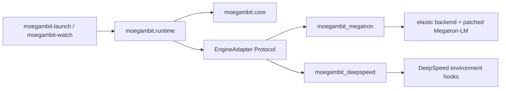

# Runtime and Adapter Architecture

## Dependency Rule

MoEGambit's policy and state contracts live in `moegambit.core`.  That package
must not import Torch, Megatron-LM, or DeepSpeed.  Process management and
wire/distributed protocols live in `moegambit.runtime`; engine-specific code
is discovered through Python entry points.



The distribution registers built-in adapters without hard-coding their import
inside the runtime:

```toml
[project.entry-points."moegambit.engine_adapters"]
megatron = "moegambit_megatron:MegatronAdapter"
deepspeed = "moegambit_deepspeed:DeepSpeedAdapter"
```

Third-party packages can register another entry point in the same group.

## Independent Features

`FeatureSwitches` contains two independent booleans:

| Hot swap | ZeRO-2 | Behavior |
| --- | --- | --- |
| off | off | Ordinary engine launch; no recovery client or optimizer replica |
| on | off | Rank replacement; optimizer comes from peer/checkpoint recovery |
| off | on | Host optimizer replication is maintained for an external recovery path |
| on | on | Rank replacement restores eligible optimizer state from host replicas |

The runtime projects both canonical and Megatron compatibility variables:

| Canonical | Compatibility |
| --- | --- |
| `MOEGAMBIT_HOT_SWAP` | `ELASTIC_HOT_SWAP_ENABLED` |
| `MOEGAMBIT_ZERO2` | `ELASTIC_ZERO2_MEMORY_REPLICATION` |

An explicit canonical value wins over compatibility variables.  When hot swap
is off, one-shot variables such as `ELASTIC_REBUILD_MODE` and
`ELASTIC_RECOVERY_EPOCH` are removed before launch.  The Megatron client also
guards client startup, pause detection, failure notification, and rebuild
entry.  ZeRO-2 allocation is guarded separately.

## Recovery Control Plane

`moegambit.runtime.protocol` defines a versioned JSON-line message.  The generic
watcher and client use that protocol without importing a training engine.
Megatron's mature watcher remains an adapter backend because its replacement
launch and recovery descriptor contain Megatron topology semantics.

`moegambit.runtime.distributed` defines `GroupManifest`, `GroupSpec`, and
`TorchDistributedProtocol`.  Every rank consumes the same ordered manifest.
An optional `WatcherOrdinalBarrier` aligns every `group_N start/done` transition
outside NCCL before the next `torch.distributed.new_group` call.  The bundled
Megatron backend uses its corresponding in-engine manifest implementation,
where existing process-group references can also be rebound.

## Adapter Contract

An adapter:

1. Detects whether it owns a training command.
2. Validates and prepares the engine command and environment.
3. Advertises hot-swap and ZeRO-2 capabilities.
4. Optionally supplies an engine-specific watcher command.

The runtime owns adapter discovery and subprocess lifecycle.  The engine
adapter owns engine flags and in-process state mapping.  This keeps recovery
policy testable without CUDA while preserving access to Megatron's optimizer
shard metadata and model-parallel group registry where those details are
actually required.

## Megatron State Sources

During the bundled single-rank replacement:

- Dense/non-expert model parameters and optimizer state are restored from a
  healthy data-parallel peer.
- Rank-local expert model parameters and optimizer state are loaded from the
  checkpoint path.
- With ZeRO-2 host replication enabled, eligible optimizer state can be
  restored from the owner rank's host-memory backup instead.
- All paths are bound to a recovery epoch and validated before reintegration.

The updated backend is under `src/elastic` and
`src/Megatron-LM/megatron/training/elastic_client.py`.  Compatibility wrappers
under `scripts/` keep the artifact's previous launch commands working.
